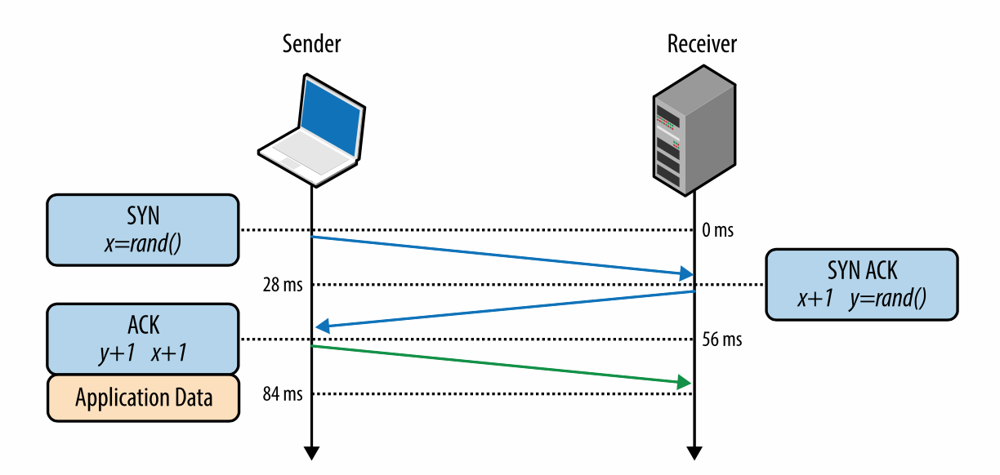
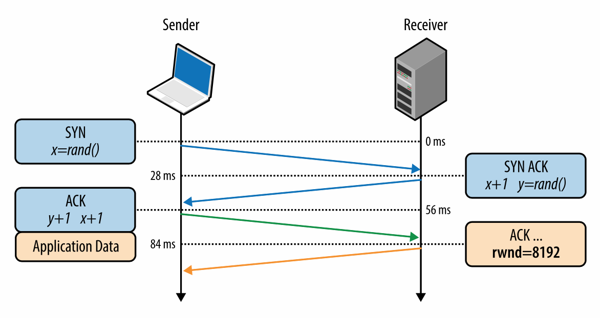

互联网中两个关键的协议是 IP 和 TCP。IP 协议用来主机间的路由和寻址。TCP 协议提供了在不可靠信道上的可靠网络抽象。 TCP/IP 首先由 Vint Cerf 和 Bob Kahn 在 1974 年发表的名为《一个用于分组网络互通的协议》中提出，用来指代互联网协议栈。

原始的提案（RFC 675）被重新修了了多次。1981 年提出的第四版 TCP/IP 规范由两个 RFC 组成，分别是
1. RFC 791 - IP
2. RFC 793 - TCP

从那之后，提出了一系列针对 TCP 协议的改进方案，但是核心的操作没有明显的改变。TCP 快速取代了之前的协议，现在是许多流行应用的选择，如 万维网、电子邮件、文件传输等待。

TCP 提供了一个在不可靠信道上建立可靠网络的有效抽象，隐藏了大多数网络交流中复杂的细节，比如说数据丢失，顺序传输，控制和避免拥塞，数据完整性等待。当使用 TCP 数据流工作保证了接收方可以分辨出发送方的每一个字节，并且按照顺序接受。TCP 是针对精确传输进行优化，而不是传输的时间，这就为网络性能的优化带来了挑战。

HTTP 标准并不强制使用 TCP 作为唯一的传输协议。如果我们想要的话，我们可以通过套接字（UDP）来传输 HTTP，或者其他的传输层协议。但是实际中，由于许多开箱即用的方便特性，互联网中所有的 HTTP 流量都是通过 TCP 完成的。

正因为如此，为了提供一个高性能的网络体验，理解一些 TCP 的核心机制是非常有必要的。亦可能不会有在应用中直接使用 TCP 套接字的机会，但是你构建应用层协议的设计性能会取决于 TCP 和底层网络的表现。

> **TCP 和 IP 协议纠缠在一起的历史**
> 我们对 IPv4 和 IPv6 都很了解，那么 IPv{1,2,3,5} 发生了什么？IPv4 中的 4 代表了在 1981 年 9 月发布的 TCP/IP 协议的第四版。原始的 TCP/IP 提案包莲莲两个协议，第四版草案官方地分成了两个 RFC。因此 IPv4 中的 v4 是历史遗留问题，并没有独立的 IPv1，IPv2 和 IPv3 协议。
> 当工作小组在 1994 年着手于“下一代互联网协议”时需要一个新的数字，但是 v5 已经在另外一个实验性的协议（互联网流式协议 ST）中使用了，ST 从来没有流行过，所以大家也几乎没有听到过。所以下一代互联网协议称为 IPv6。

# 三次握手
所有的 TCP 连接均由三次握手开始，如图 2-1 所示。

图 2-1 三次握手

在客户端或者服务器端可以交换应用层的数据之前，连接的两端必须在数据包的序列号上达成一致，同时这个序列号座椅连接的一个参数。由于安全因素，这个序列号是随机采用的。

*SYN*
客户端算则一个随机的序列数 x 并且发送一个包含其他额外 TCP 标志和选项的 SYN 包

*SYN ACK*
服务器端将 x 加一，自己选择一个随机的序列数 y，加上一些自己的标志和选项，发送应答

*ACK*
客户端将 x 和 y 均加一，通过发送 ACK 包完成握手。

一旦完成了三次握手，应用层的数据开始在客户端和服务器端传输。客户端可以在 ACK 包之后直接发送数据包，服务器端必须等到 ACK 之后才可以发送数据。这个初始化过程发生在每一个 TCP 连接，并且暗示了每一个使用 TCP 协议的性能：每一个新的连接在发送应用层数据前都会有一个往返的延迟。

举例来说，如果我们的客户端在纽约，服务器端在伦敦，我们通过光纤建立一个新的 TCP 连接，那么三次握手至少占用 56 ms，表 1-1 中展示了一个方向的传播延迟是 28 ms，之后它还要返回纽约。注意，带宽在连接中没有起到作用。实际上，延迟是由客户端和服务端之间信号传播的延迟造成，也就是从纽约到伦敦的传播时间。

由于无法避免由三次握手造成的延迟，建立新的 TCP 连接是很昂贵的，所以连接重用是运行在 TCP 上应用的重要优化方式。

> **TCP 快速连接**
> 加载一个网页通常需要从十几个不同的主机获取几百个资源。换句话说，这需要浏览器建立十几个新的 TCP 连接，每一个都会因为 TCP 握手带来额外的开心。这显著增加了网络浏览的延迟，尤其是在移动网络中。
> TCP 快速连接（TFO) 是一个用来通过在 SYN 包中传递数据从而降低建立 TCP 连接延迟的机制。 然而它有它自己的局限性， SYN 包的大小有限制，只有几种 HTTP 请求可以发送，由于需要加密 cookie，它只能在重复连接上使用。你可以在最新的 IEFT 草案中找到 TCP 快速连接
> 使用 TFO 需要服务器端，客户端以及应用的支持。最好的结果是在 linux 内核 v4.1 以上以及相应的客户端（比如 Linux, iOS9+/OSX 10.11+）并且在应用中开启了合适的套接字选项。 
> 基于谷歌完成的流量分析和网络模拟，研究人员展示出 TFO 可以降低 15% 的 HTTP 延迟，平均减少 10% 的页面打开时间，在高网络延迟的情况下可以降低 40%。

# 拥塞避免和控制
早在 1984 年，John Nagle 记录了被称作“拥塞崩溃”的情况。这种情况可能影响节点间带宽不对称的网络。

> John Nagle, RFC 896
> 在复杂网络中可以观察到拥塞控制的问题。我们已经发现了国防部的 IP 协议 - 纯的数据报协议，和 TCP 协议 - 传输层协议 一起使用的时候，传输层和数据报层的交流会造成一个不常见的拥塞问题。实际上，IP 网关很容易受到“拥塞崩溃”现象的应用，尤其是网关连接了两个带宽不一样的网络。
> 当主机的往返时间超过了最大传输间隔，主机会发送越来越多相同数据的拷贝到网络中去。最终，当交换节点上所有可用的缓存都被占满，数据包会被丢掉。数据包的往返时间达到最大值时，主机会多次发送相同的数据包，并且目的地也会收到每一个包的多个拷贝。这就是拥塞崩溃。
> 这种情况是稳定的。一但达到了网络的饱和点，如果数据包是随机丢弃的，网络会持续在这种糟糕的环境中运行。

这个报告指出了在 ARPANET 中，拥塞崩溃的现象不会成立，因为大多数的节点带宽相同，并且主干网络有潜在的额外容量。然而这些断言并没有很快就不再成立。在 1986 年，网络节点数量大量增加，一系列的拥塞崩溃问题横扫整个网络，一些情况下网络容量下降的千分之一，一些网络变得不可用。

为了解决这些问题，TCP 实现了多种机制来控制数据的发送速率：流量控制，拥塞控制和拥塞避免。

**note**
> 美国高级研究计划署(ARPANET) 是现代互联和的先驱，搭建了世界上第一个可操作的包交换网络。这个项目在 1969 年真是开展，在 1983 年 TCP/IP 作为主要的交流协议取代了更早的网络控制项目（NCP）。正如他们所说，其余的都变成了历史

# 流量控制
流量控制是用来阻止发送方发送接收方无法处理的数据的机制。接收方可能巨大负荷下，状态繁忙，或者是仅仅接受缓存大小决定的数据量。如图 2- 2 所示，为了解决这个问题，TCP 连接的两端都公布出它的接受窗口（rwnd），用来交流数据接收缓存的大小。

图 2-2 接受窗口（RWND）大小