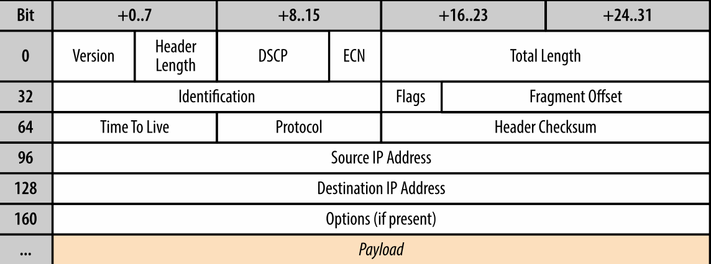
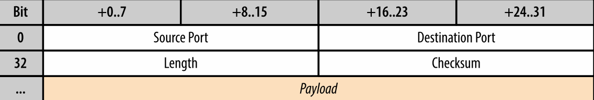
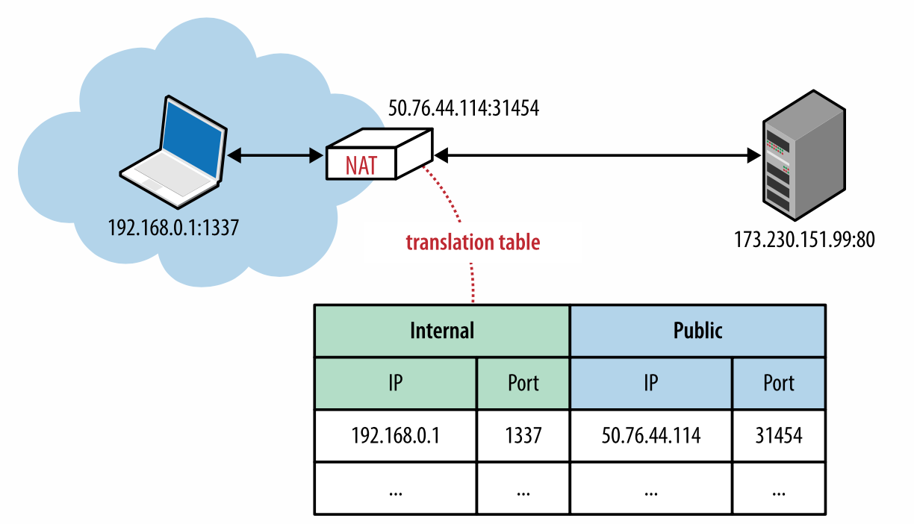
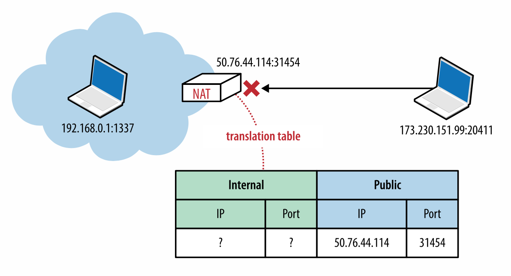
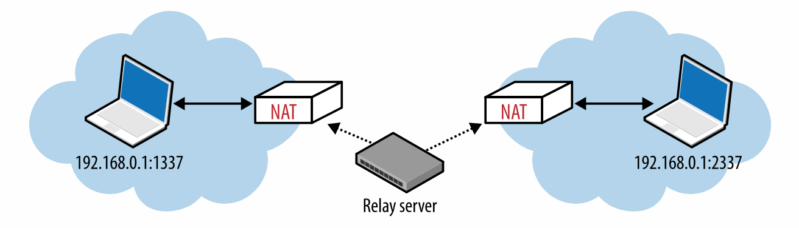

1980 年 8 月 Jon Postel 将用户数据报协议添加进互联网协议核心套件。UDP 协议在原始的 TCP/IP 协议之后，和 TCP/IP 规范分为两个独立的 RFC 时间差不多。你会看到这个时间点是十分关键的，UDP 吸引人的特点不是它引入了什么，它忽略了什么。UDP被通俗地称为空协议，描述它的 RFC 768 基本上可以写在在一张餐巾纸上。

*数据报*

一个自包含的独立数据传输实体，包含了足够的信息使其可以在不依赖之前的数据交换和传输网络，从源节点发送到目的节点。

数据包和数据报经常被混用，但是它们之间还是有一些细微的差别。“数据包” 这个术语使用在一些格式化的数据块上，“数据报” 用于在不可靠服务上传递的数据包，没有传输保障，没有错误提醒。你会发现在 UDP 这个缩写中，你会发现 “U” 通常用来描述 “不可靠”(Unreliable), 而不是官方的 “用户”(User). 这也是为什么 UDP 数据包一般或者说更准确的被称为数据报。

大概最著名的 UDP 的使用是每一个浏览器和互联网应用都会用到的域名系统(DNS)。它提供了一个用户有害的电脑主机名，我们需要在数据交换之前找到它的 IP 地址。然而，即使浏览器自身依赖 UDP，历史上这个协议从来没有作为传输页面和应用的第一梯度，直到 WebRTC 的出现。

由 IETF 和 W3C 工作组开发的新网络实时交流(WebRTC)标准实现了直接在浏览器上通过 UDP 实时交流，诸如声音和视频电话或者其他端到端(P2P)的交流。有了 WebRTC，UDP 现在是一等浏览器传输协议，拥有客户端的 API！我们会深入研究 WebRTC，但是在此之前我们先探索一下 UDP，理解为什么要使用 UDP 以及哪里可以使用 UDP。

# 空协议服务
为了理解 UDP，以及它为什么被称为空协议，我们要先了解一下在 TCP 和 UDP 下一层的 IP 协议

IP 层的主要任务是根据地址在源主机和目的主机之间传递数据报。为了实现这个目的，信息被封装成 IP 包，如图 3-1 所示，标明了源地址和目的地址和一些其他的路由参数。

图 3-1 IPv4 头(20 字节)

再次声明，"数据报" 这个词指明了 IP 层对信息不提供任何保证或错误提示，直接将底层网络的不可靠暴露给了上层。如果路由节点因为拥塞，高负载或者其他原因丢失了数据包，如果希望有错误检测，恢复，重新传送数据等行为，那么应该由 IP 之上的协议负责。

UDP 协议用它自己的包结构封装了用户信息，如图 3-2 所示，它只添加了四个额外信息：源端口，目的端口，包长度，校验和。因此，当 IP 将数据包送达目的主机，主机可以拆开 UDP 包，通过目的端口判断目标应用，并且传递信息。除此之外，没有其他的功能。

 
图 3-2 UDP 头

事实上，源端口和校验和在 UDP 中都是可选项。IP 包含了它自己的头校验和，应用可以选择忽略 UDP 校验和，这就意味着所有的校验和以及错误纠正都由之上的应用负责。UDP 的核心仅仅是在 IP 之上建立了"应用复用"，把源和目标应用的端口放入包中。现在我们可以总结一下 UDP 不能提供的服务：

*不保证信息送达* 没有回应，重发或者超时

*不保证按序送达* 没有包序号，没有重排序，没有线头阻塞

*没有连接状态跟踪* 没有连接建立或者关闭的状态机

*没有拥塞控制* 没有内键的客户端或者网络反馈机制

TCP 是一个面向字节流的协议，可以将应用信息拆分成多个数据包而不用在数据包中显式的添加信息界线。为了实现这一点，连接状态包含了连接的两端，并且每一个数据包都要编序，重传丢失的数据包，按顺序发送。另一方面，UDP 数据报有明显的界限：每一个数据包都通过单一的 IP 包，应用可以从中获取全部的信息，数据报不能拆分。

UDP 是一个简单的，没有状态的协议，适用于启动应用层的其他协议。事实上，所有的协议设计决策都留给上层的应用。然而，在你实现用来替换 TCP 的你自己的协议是，你应该仔细思考一下相关的复杂性，诸如 UDP 和其他部署好中沙盒（NAT traversal）之间的交互，通用网络协议的最佳实践等等。没有认真的设计和计划，通常一个闪光的点子会变成一个简陋版的 TCP。TCP 中的算法和状态机经过数十年的打磨，采用了许多机制，并不是那么容易被替换的。

# UDP 和网络地址转换
不幸的是，IPv4 地址只有 32 位长，只提供了最多 42.9 亿个独立 IP 地址。在 1994 年年中提出的 RFC 1631 中引入了 IP 网络地址转换 (NAT) 标准作为一个用来解决 IPv4 地址逐渐用尽的方案。互联网中的主机数量在 90 年代中期开始指数增长，我们不能给每一个主机分配一个唯一的 IP。

这个 IP 重用的方案在接入网中引入了 NAT 设备的概念，它负责维护一个路由表，将本地 IP、端口元组映射到一个或多个唯一个公网 IP 和 端口元组，如图 3-3 所示。

图 3-3 IP 网络地址转换

转换器所在的本地 IP 地址可以在许多不同的网络中复用，因此可以用来解决地址用尽的问题。

不幸的是，临时的方案会用的很久。 NAT 设备不仅仅解决了这个问题，而且它迅速成为了一个许多公司和家庭，以及许多代理，路由器，防火墙和许多其他硬件设备中不可或缺的组件。NET 中间沙盒不再是一个临时方法，它们变成了固定在互联网中的一个基础设施。

>**私有保留网络**
>互联网编号分配机构（IANA）是一个负责全球IP地址分配的机构，预留了三个著名的私有网段，如表 3-1 所示，经常用在 NAT 设备内部网络
> 
IP 地址范围| 地址数量
------------|--------
10.0.0.0 - 10.255.255.255 | 16,777,216
172.16.0.0 – 172.31.255.255 |1,048,576
192.168.0.0 – 192.168.255.255|65,536

表 3-1 IP 保留网段
> 上述的的地址范围应该看起来很熟悉。你的本地路由已经在上述网段中给你的电脑分配了一个 IP 地址。当你和外部网络交流的时候，你的内网私有 IP 地址会被 NAT 设备转换。
> 为了避免路由错误或混淆，不允许分配上述预留私有网段给公网电脑。

# 连接状态超时
NAT 转换的问题，至少是 UDP 需要考虑的是，为了传递数据包它必须要维护路由表。NAT 中间沙盒依赖连接状态，而 UDP 没有。基础的不匹配是传输 UDP 数据报中许多问题的源头。更重要的是，现在有许多的客户端是在 NAT 层构建的内网中，这使得问题变得越来越复杂。

每一个 TCP 的连接都有一个严格定义的状态机，从握手开始，之后是应用数据传输，以及一个严格定义关闭连接的交换。给定这个流程，每一个中间沙盒都可以观察到连接建立的状态，添加和删除所需要的路由。在 UDP 中，没有握手或者连接终结，因此没有连接状态机或者监视器。

向外传递 UDP 信息并不需要任何额外的工作，但是传递一个回复信息需要告诉我们目的地本地 IP 地址和端口号的转换表。因此，转换器需要保持每一个 UDP 流的状态，虽然 UDP 本身是无状态的。

更糟糕的是，转换器还需要弄清楚什么时候删除这个转换记录，由于 UDP 没有连接终止的信号，连接双核只需要在任何时候停止传输数据包而不需要任何通知。为了解决这个问题，UDP 路由记录在一定时间内超时。那么多久呢？这没有一个固定的答案，取决于设备提供商，版本以及转换器的配置。因此，长时间运行的 UDP 会话的最佳实践之一就是引入双向保持报文，定期的重置计时器用于在所有的 NAT 设备上保持转换记录。

>**TCP 超时和 NAT**
>从技术上上，在 NAT 设备上不需要额外的 TCP 超时限制。 TCP 协议遵循一个严格定义的祸首和中间序列，给添加和删除相应的转换记录发送了信号
>不幸的是，许多 NAT 设备给 TCP 和 UDP 会话提供了类似的超时逻辑。结果在一些情况下，TCP 也需要双向保持连接的数据包。 如果你的 TCP 连接断开可能是因为一个中间 NAT 超时。

# NAT 穿透
不可预测的连接状态处理是 NAT 造成的一个严重的问题，但是无法建立 UDP 连接对于大多数应用来说是一个更大的问题，尤其对于 VoIP，游戏和文件共享等 P2P 的应用，它们经常需要在两端之间建立双向连接。

第一个问题是由于 NAT 的存在，使得内部客户端无法意识到它的公网 IP，只知道它的私有 IP。 NAT 设备将 IP 包中的 IP 地址以及 UDP 报中的源端口和地址改写。然而当客户端将它的私有 IP 地址作为应用数据的一部分的时候，这个连接将断开。因此，装换中 “透明” 的保证不在正确，应用数据如果想要和外部网络分享它的私有地址时必须首先知道它的公网 IP 地址。

然而，仅仅知道公网 IP 并不能保证 UDP 传输成功。任何数据包通过公网 IP 到达一个 NAT 设备的时候必须有一个目的端口并且在 NAT 表中可以将它转换到内部目的 IP 和端口。如果不存在这样的转换，这种情况很可能是有人简单的通过公网传输数据，我们只需要将这个包丢掉，如图 3-4。NAT 设备扮演了一个数据包过滤的角色，因此没有方法自动决定内部路由，除非由显式的配置端口转发或者类似的机制。

图 3-4 丢弃不匹配的数据包

值得注意的是，上述问题对于客户端应用都不是问题，它们只需要和内网中建立的连接进行交流即可，相应的转换记录会像上文描述的那样建立起来。然而 VoIP，游戏和文件共享等 P2P 的应用在 NAT 的出现的情况下回面临上述的问题。

为了解决 UDP 和 NAT 的不匹配，许多穿透技术(TURN,STUN,ICE)被用来建立 UDP 的端到端连接。

# STUN， TURN， 和 ICE
RFC 5389 制定的 NAT 的会话穿透工具协议 (STUN) 允许主机应用发现网络中的网络地址转换器，并且获取当前连接分配的公网 IP 和端口元组。如图 3-5 所示。为了实现这样的功能，协议需要一个部署在公网上众所周知的第三方 STUN 服务器。

图 3-5 STUN 查询公网 IP 和端口

假设已经知道了 STUN 服务器的 IP 地址(通过 DNS 发现或者手工指定地址)，应用首先发送一个绑定请求给 STUN 服务器。反过来，STUN 服务器返回一个 STUN 服务器从公网中观察到的公网 IP 地址和端口。这个简单的工作流解决我我们之前遇到的一系列问题：
1. 应用发现自己的公网 IP 和端口，并且可以使用这个信息作为和另一端交流的应用数据的一部分
2. 发送给 STUN 服务器的请求建立了 NAT 路由映射关系，这样通过公网 IP 和端口收到的数据包可以找到内网中的主机应用
3. STUN 协议定义了一个简单的机制通过发送 ping 来保持 NAT 路由中的映射实体。

有了这样的机制，无论何时两端想要通过 UDP 交流，它们会先发送绑定请求给各自的 STUN 服务器并且受到相应的回复，之后它们可以使用公网 IP 和端口来交换数据。

然而，实际上 STUN 是不足以应对所有的 NAT 结构和网络配置。更重要的是，在一些情况下，UDP 可能会被防火墙或者一些其他网络设备阻塞，这在一些企业中是十分常见的情景。为了解决这个问题，当 STUN 失败的时候，我们可以使用 RFC 5766 指定的 NAT 中继穿透协议 (TURN) 作为备用方案，它可以运行在 UDP 之上，如果失败的话转向使用 TCP。

 TURN 的关键词是“中继”，这个协议依靠两端均可使用的公网中继，如图 3-6 所示。

 

 图 3-6 TURN 中继服务器

 1. 两端通过向同一个中继服务器发送发送地址分配请求，之后进行许可协商
 2. 一旦协商完成，两端通过向 TURN 服务器发送数据进行通信，TURN 服务器将数据中继给另外一段

 