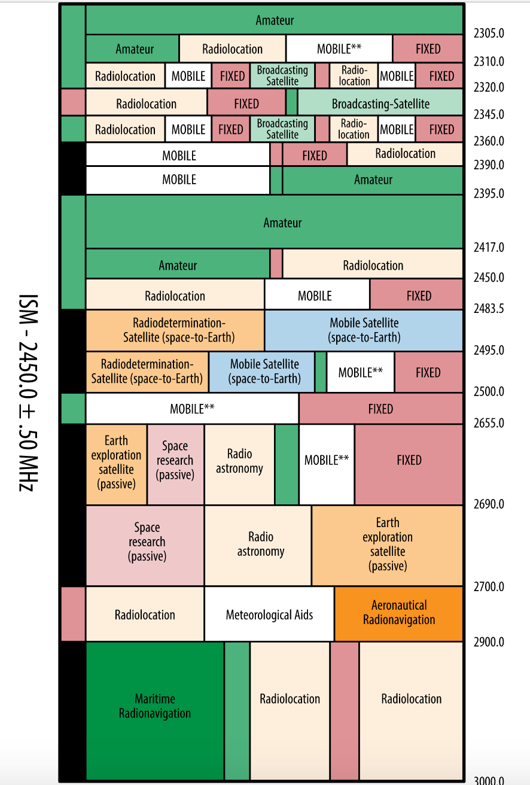
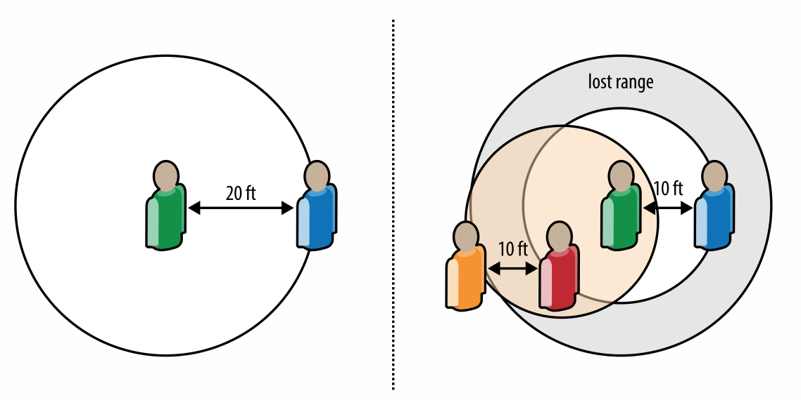

# 无处不在的连接
最近几年最大的一个技术变化趋势是实用性和无处不在的连接。无论是查看电子邮件，语音交流，网络浏览还是其他各种各样的使用清洁，我们现在都希望可以通过在线服务实现，无论地点，时间，也无论是在跑步中，排队，办公室，地铁，还是飞机中。今天，我们还是需要寻找联网方式（例如，查找最近的 WiFi 热点），毋庸置疑的是，未来连接将会无处不在，我们随时随地可以连接互联网。

无线网络是这个趋势的热点。通过无线网络连接任何网络不需要线缆，这给用户带来了便捷和可移动性。面对各种各样的使用场景和应用，我们也需要多种无线技术来满足这些需求，每种技术都有它性能特点并针对特定的任务镜像优化。今天，我们已经有了数十种广泛使用的无线技术，例如 WiFi，蓝牙，ZigBee, NFC, WiMAX, LTE, HSPA, EV-DO, 早期 3G 标准, 卫星通信等等。

这就说，不顾无线网络技术的多样性，简单的抹平不同无线技术性能的差异是不明智的。好消息是大多数的无线技术都满足通用的原则，面临相同的取舍，并且服从相同的性能标准和约束。一旦我们理解了这些基础的原则，我们可以轻松的理解大多数的无线技术。

尽管通过无线电通信的数据传输技术和有线技术的机制有着本质上的不同，但是对于用户体验而言应该是大致相同的。对于长时间运行的应用有更大几率通过无线网络连接彼此，没有 *有线应用* 这样的需求。

所有的应用应该在各种连接方式下都有良好的性能。作为用户而言，不需要在意底层使用的连接技术，但是对于开发者来说，必须思考应用架构来适应不同的网络类型。好消息是，应用在无线网络上的优化也会提升在其他环境中的体验。让我们深入了解一下吧。

# 无线网络类型
一组设备连接相互连接起来形成了网络。在无线网络中，通常使用无线电作为通讯介质。然而，在无线电的细分类中，有数十种不同的技术适用于不同的规模，拓扑结构和使用情景。”地理范围“ 是一种区分方式：

|类型|范围|应用|标准|
|----|----|-------|--------|
|个人网络（PAN）|一个人的范围内|替代外设的电缆|蓝牙，ZigBee, NFC|
|局域网络（LAN）|建筑或校园内|有线网络的无线扩展|IEEE 802.11 （WiFi）|
|城域网（MAN）|城市中|内部网络的无线连接|IEEE 802.15 （WiMAX）|
|广域网（WAN）|世界范围|无线网络接入|移动电话 (UMTS, LTE,等等)|

表 5-1 无线网络类型

上述的分类既不完全也不精确。许多技术和标准需要从一个精确的使用场景开始，例如蓝牙是为了 PAN 应用和取代线缆，并且可以逐渐提升吞吐。事实上，至少在最新的蓝牙草案中为了更高带宽的使用场景，提供了和 802.11（WiFi）无缝连接的能力。同样的，像 WiMAX 这样的技术的出发点是固定-无线的解决方案，但是逐渐增加了额外的移动能力，使它们可以使用在 WAN 和移动通讯中。

分类的关键不是将每一个技术都分开而是在更高层次概况它们使用情景的不同。一些设备可以使用连续电源，另一些必须优化电池使用量。一些情景需要 Gbit/s 以上的数据速率，另一些只需要几十或几百的数据（例如 NFC）。一些应用需要保存始终在线，还有一些需要保证延迟较低。大量的评判标准决定了不同网络类型的特点。然而，每一个标准都在不断进化，更好的电池容量，更快的处理器，更好的算法，每一个无线标准都在不断的改进以扩展应用场景和性能。

>*note*
>
>你的下一个应用可能通过移动网络传递数据，它可能使用 NFC 来实现支付，使用蓝牙通过 WebRTC 实现 P2P 交流，WiFi 可以用来 HD 视频流。这不是一个选择的问题,或押注,只有一个无线标准!

# 无线网络的基础性能
每一种无线技术都有其一系列的限制。让我，无论使用哪一种特定的无线技术，所有通信方式都有其最大信道容量，这有相同的规律决定。实际上，克劳德·艾尔伍德·香农给了我们用于藐视最大信道容量的精确数学模型[信道容量是最大的信息速率](https://hpbn.co/introduction-to-wireless-networks/#channel-speed)。

$$C=BW * log_2{(1+\frac{S}{N})}$$
1. C 代表信道容量，用每秒传输的比特数量衡量的
2. BW 代表可以使用的带宽，用赫兹衡量
3. S 是信号，N 是噪声，均由瓦特衡量

信道容量是最大的信息速率

尽管简化了一些细节，这个公式抓住了我们需要理解的有关大多数无线网络性能的要点。无论它叫什么，简称是什么，规范的版本号是多少，可以达到的数据速率均由两个基本的限制条件，它们是可使用的带宽以及接收方和发送方之间的信号强度。

## 带宽
有线世界中，线缆将网络中的任意两端连接起来，相反无线电通讯使用了天然的共享介质-无线电波，如果你更喜欢的话也可以叫电磁波。在需要通讯的时候，发送方和接收方必须在通讯频段上达成一致，定义良好的频段使得设备之间可以无缝交互。举例来说，802.11b 和802.11g 标准规定了 WiFI 设备使用 2.4 GHz 到 2.5 GHz 的频段。

那么谁决定了并分配了频段？简短来说，是当地政府（图 5-1）。在美国，这个过程由联邦通信委员会（FCC）掌管。实际上，由于不同的政府规定，一些无线技术只能在一定区域内使用。不同的国家经常将相同的无线技术分配到不同的频段上。

将政治因素放在一边，虽然它经常是合作的障碍，分配到的频段大小是决定性能的重要因素。正如香农模型展示的那样，整个信道的比特率和频段成正比。因此，如果其他因素相同，将可用频段加倍，数据速率也会加倍，例如，20 MHz 的带宽增加到 40 MHz 可以加倍信道的数据速率，这也是为什么 802.11n 相比早期的 WIFi 标准提升了性能。

值得注意的是，不是所有的频段提供了相同的性能。低频率信号传输的更远，可以覆盖更大的区域，但是它需要更大的天线和更多的客户端接入冲突。反过来说，高频率信号可以传输更多的数据但是不能传递的很远，这造成了更小的覆盖面积和更多的基础设施。

>*note*
>
> 对于一些应用来说确定频段是相当重要的。只需要广播的应用（例如广播电台）比较适合低频段。另一方面，双向通信得益于使用在小房间中，它提供了更高的带宽和更少的竞争。

图 5-1 FCC 在 2,300 到 3,000 MHz 频段的分配

> **世界范围内的频段分配与规则的简史**
> 如果你了解过无线交流的世界，无可避免的会被无数的有关当前频段的状态和价值的争论所困惑。它的历史是什么样的呢？
>
> 在无线电的早期，每一个人都可以使用他想使用的任意频段。1912 年的签署进美国法律的无线电法改变了这一切，无线电频谱的使用需要证书授权。原始的法案的制定一部分因为有关泰坦尼克号沉没的调查。一些推测任务如果附近的船只监听了适当的频段可以避免那场灾难，或者可以拯救更多的人。无论如何，这个新法律成为了国际和联邦立法的无线交流先例。其他国家紧随其后。
>
> 几十年之后，1934 年的通讯法案成立了联邦通信委员会（FCC），从此以后 FCC 负责管理美国的频谱分配，有效的将其分成更小的频段使其可以分开使用。
>
> 区别分配的一个好的例子是“工业，科学和医学”（ISM）无线电频段，它由国际电信会议在 1947 年建立，正如它名字中暗示的那样，是一个国际范围内的保留频段。 在现代无线交流中发挥了重要作用的 2.4–2.5 GHz (100 MHz) 和 5.725–5.875 GHz (150 MHz) 都是 ISM 频段的一部分。更重要的是，这些 ISM 频段都被认为是 “无证书授权频段”，这使得每一个人都可以运行一个无线网络用于个人或者商业用途，只要使用的硬件满足特定的技术要求（例如发射功率）。
>
> 最后，由于无线交流需求的上升，许多政府着手进行“频段拍卖”，出售在特定频段传输特定信号的证书。虽然例子比比皆是，2008 年发生的 700 MHz FCC 拍卖仍旧值得一提：美国 698–806 MHz 的频段出售给了许多不同的投标人共计 195.920 亿美元（这个频段被分割成许多小块）。是的，单位是亿美元。
>
> 带宽是一个稀有且昂贵的商品。无论当前的分配是否公平，它都有许多的缺陷需要改进。我们有一件事情可以确信的是，它仍旧会充满争论。

## 信号强度
除了贷款，所有的第二个无线交流基础的限制因素是接收方和发送方之间的信号强度，又被称作信噪比，S/N 或 SNR。本质上说，它衡量了信号和背景噪声干扰之间的比例。为了传输信息，背景噪声越大，信号需要越强。

就其本质而言，所有的无线电交流必须通过介质，这就是说其他的设备可能产生不必要的干扰。举例来说， WiFI 使用的 2.5 GHz 的微波创造了创造了横跨标准的干扰。其他的 WiFi 设备，比如说你邻居的 WiFi 接入点，甚至你合作者接入相同 WiFi 的笔记本电脑都为你的数据传输造成了干扰。

在理想状态下，你可以在确定频段内是唯一的使用者，没有其他的背景噪声或者干扰。不幸的是，这是不可能的。首先，带宽是稀少的，其次，有太多的无线设备使之不可能实现。为了在有噪声的情况下实现希望的带宽，我们要么增加发射功率以此增加信号的强度，或者降低发送者和接收方之间的距离，当然可以同时采取两种方法。

>*note*
>
>路径损耗或者说通路衰减描述的是因为传输距离造成的信号强度下降，精确的降低比率有环境决定。完整的讨论超出了本书的范围，如果你好奇的话，使用你最喜欢的搜索引擎查阅相关资料。

为了解释信号，噪声，发射功率和距离之间的关系，想象一下你在一个小房间中，和距你 20 英尺的某人讲话。如果没有其他人在场，你们可以用正常音量交流。然而，现在房间中加入多个人，例如人群聚会等，每一群人都有自己的交流。突然之间，你听不到你同伴的声音了。当然，你开始加大你的音量，这样对于你附近人的来说他们的“噪音”也增加了。反过来，他们也开始加大音量，这进一步增加了环境噪音和干扰。不知不觉间，房间里的每一个人都只能和附近的人进行交流，如图 5-2。 如果你曾经有过在嘈杂环境中需要侧身才能听清的经历的话，你已经对 SNR 有了切身的体会了。

图 5-2 日常生活中的远近效应与小室呼吸（cell-breathing）

实际上，这个场景展示了两个重要的场景：
1. *远近效应*  接收方pu'ho'yi'ge捕获一个距离很近的强信号使其很难检测到较弱的信号，或者说挤掉了弱信号。

2. *小室呼吸* 覆盖的区域，或者说信号的距离根据当前环境的干扰和噪音扩大或缩小。

你旁边的一个或更多的大声讲话者会阻挡弱小的信号，这是远近效应。同样的，你附近的对话越多，干扰越大，你能收到的信号范围越小，这是小室效应。这些限制出现在所有无限通讯中，无论底层采用了什么协议。

## 调制

可用带宽和 SNR 是两个主要的物理因素，它决定了任何无线通道的容量。然而，信号的编码算法可以有显著的作用。

表面看来，我们的数字码表（0 和 1）需要被翻译到模拟信号（无线电波）。*调制* 是数字到模拟转换的过程，不同的 “调制码表” 需要不同的数字信号编码算法，这导致了效率的不同。码表和符号速率的组合决定了最终的信道吞吐量。用一个例子来说明：
1. 接收方和发送方可以处理 1,000 个脉冲或者符号每秒 （1,000 波特）
2. 传输么承恩符号代表了一个不同的比特序列，由码表决定（例如：2-比特 码表：00，01，10，11）
3. 信道的比特率是 1,000 波特 * 2 比特每符号，或者说 2,000 比特每秒。

调制算法的选择由可用技术，接收方与发送方的计算能力以及 SNR 决定。一个高阶的调制算法可以提高面对噪音和干扰的鲁棒性，天下没有免费的午餐。

>*note*
>
>不要紧张，我们不打算深入挖掘信号处理的世界。当然，理解调制算法对无线信道容量的影响，但是，这也取决于 SNR，可用处理能力以及其他常见的妥协。

# 衡量实际的无线性能
我们有关信号理论的简短课程可以总结为无论无线网络叫什么，简称是什么，规范的版本号是多少，可以达到的数据速率均由一些常见参数限制。特别是接收方与发送方之间的带宽和信噪比。进一步来说，所有的无线交流有如下特点：
1. 通过无线介质完成
2. 与使用的频段有关
3. 与传输强度有关
4. 不断变化的背景噪声与干扰的限制
5. 所选的无线技术的限制
6. 设备的限制，如功率等

所有的无线技术都有峰值，或者说最大传输速率。举例而言，802.11g 标准的容量是 54 Mbit/s，802.11g 标准的速率上限是 600 Mbit/s。同样，支持 LTE 技术的手机可以达到 100+ MBit/s 的速率。然而，经常忽视掉的一点是这都是在理想情况下的数值。

什么是理想情况呢？你猜出来了，使用了所有分配到的带宽，独占了频谱，最小或没有噪音，最大吞吐的吞调制码表，并行传输的多路无线电数据流（多输入和多输出，或 MIMO），不限制电源，使用了最佳的调制算法。如果你实在在意性能，你应该选择有线技术。无线技术带来的便利是有代价的。

衡量无线技术的性能是一个有技巧的事情。接收方位置上一个微小的变化可以轻易地引起几倍的吞吐量的变化，不久之后吞吐量可能因为另一个接收方被唤醒，竞争使用无线信道而减半。无线性能在剧烈变化，这是很自然的。

最后，注意我们之前的讨论专注于吞吐。我们故意忽略了延迟么？实际上，无线技术的延迟和所选用的技术直接相关，这是我们接下来要讨论的。
