# 移动网络
截至 2013 年初，全球约有 64 亿个蜂窝网络连接。仅在 2012 年，IDC 市场情报报告显示智能手机，平板电脑，笔记本电脑，个人电脑等智能连接设备的出货量估计为 11 亿美元。更为值得注意的是今后几年的高速增长预测：同一个 IDC报告预测 2016 年新设备出货量将攀升至 18 亿以上，其他报告预测到 2020 年总共超过 200 亿台连接设备。

预计 2012 年人口将达70亿，2020 年将达到 75 亿，这些趋势说明了我们对智能连接设备的需求：显然，我们大多数人不满足只有一个设备。

然而，连接设备的绝对数量只是整个故事的一小部分。高速连接设备无休止的增长暗示着无处不在的连接需要适配所有的新设备。这就是为什么我们必须将话题转移到各种移动电话技术上，例如 GSM，CDMA，HSPA 以及 LTE。很可能的情况是，大多数用户将使用这些技术之一，一些专门用于访问您的网站或服务。需要的投入很多，但是我们必须做到这一点，移动网络肯定会有一系列性能挑战。

# “G” 的历史简述
弄清楚各种各种移动通信技术标准，发布版本以及对应的优缺点，不止会占用这一章，而是整本书。这里，我们的目标很简单，我们需要了解市场上占据主要地位的无线技术，表7-1 中列出里程碑式的版本对应的参数及其影响。

版本|峰值速率|描述
---|-------|---
1G|无法传输数据|模拟系统
2G|Kbit/s|第一个与模拟系统并行的数字系统
3G|Mbit/s|与模拟系统并行部署的专用数字网络
4G|Gbit/s|数字化且只能传输数据包网络

表7-1  各个版本的移动通讯技术

第一个需要理解的是每个无线电的基本标准都以峰值频谱效率（bps / Hz）表示，然后将其转换为便于记忆的数字，例如4G网络的 Gbit/s+ 峰值数据速率。然而，你现在应该认识到前一句话中的关键词：峰值！回顾我们早前关于[测量现实世界无线性能](https://hpbn.co/introduction-to-wireless-networks/#measuring-real-world-wireless-performance)的讨论，峰值数据速率是在理想条件下实现的。

无论标准如何，每个网络的实际性能将由供应商，网络配置，给定单元中的活动用户数，特定位置的无线电环境，正在使用的设备以及所有其他因素影响。考虑到这一点，虽然在现实世界环境中不保证数据速率，但是一个简单但有效的校准性能预期的策略（表7-2）是假设数据吞吐量的下限与延迟的上限。

版本|数据速率|延迟
--|--|--
2G|100-400Kbit/s|300-1000ms
3G|0.5-5Mbit/s|100-500ms
4G|1-50Mbit/s|<100ms

表7-2 活跃网络连接的数据速率和延迟

更复杂的是，任何给定网络的分类如 3G 或 4G 都太过粗糙，预期的吞吐量和延迟也只是大致预估。为了理解为什么是这样的情况，以及行业的前进方向在哪里，我们首先需要快速调查不同技术的历史和发展背后的关键角色。

## 第一代数据服务 2G
1G 网络在 1979 年于日本第一次投入商用。它是一个模拟系统，不提供任何数据传输服务。在 1991 年，第一个基于 GSM（全球移动通信系统）2G 网络登陆芬兰，它将数字信号引入了无线电网络，开启第一个电路交换移动数据业务，例如文本消息（SMS），和以 9.6Kbit/s 峰值速率的数据包传递服务！

直到 20 世纪 90 年代中期，当通用分组无线业务（GPRS）首次被引入到GSM标准时，无线因特网的接入开始成为现实，尽管它仍然非常缓慢：使用 GPRS，现在可以达到 172 Kbit/s，典型的往返延迟在高达数百毫秒。GPRS 和早期 2G 语音技术的组合通常被描述为 2.5G。几年后，EDGE（GSM 增强数据速率进化版）增强了这些网络，将峰值数据速率提高到 384 Kbit/s。第一个EDGE 网络（2.75G）于 2003 年在美国推出。

在这一点上，停下脚步进行反思是必要的。无线通信已经有数十年的历史了，但实际的，面向消费者的移动网络数据服务是近来的现象！2.75G 网络只有十年之久，但是也已经在全球广泛应用。然而，我们大多数人现在根本无法想象没有高速无线接入的生活。无线技术的演进和使用率已经不再令人吃惊。

## 3GPP 与 3GPP2 之间的合作
一旦消费者对无线数据业务的需求开始增长，无线电网络的交互性问题成为所有参与者的热点问题。一方面，电信提供商必须购买和部署用于无线电接入网络（RAN）的硬件，这需要投入大量资本并长期维护-标准化硬件意味着降低成本。类似地，没有行业标准，用户将被限制在他们的家庭网络中，限制了移动数据访问的使用场景和便利性。

作为回应，欧洲电信标准研究所（ETSI）在 20 世纪 90 年代初制定了 GSM 标准，许多欧洲国家和全球迅速采用。事实上，GSM 仍旧是部署最广泛的无线标准，据估计，覆盖了市场份额的 80％-85％（图7-1）。但并不是唯一的一个。同时，高通公司开发的 IS-95 标准也占据了 10％-15％ 的市场份额，其中最着名的是许多横跨北美的网络部署。因此，为 IS-95 无线电网络设计的设备不能在 GSM 网络上运行，反之亦然 - 这是许多国际旅客熟悉的糟糕体验。

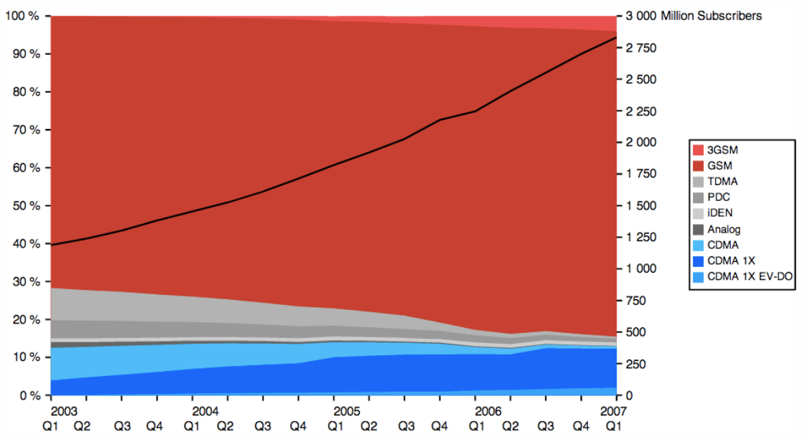

图 7-1 2003-2007 年之间移动网络的市场份额

1998 年时，由于认识到部署标准的全球演进以及下一代（3G）网络的需求，GSM 和 IS-95 标准组织的参与者组成了两个全球合作项目：

*第三代合作伙伴计划（3GPP）*

负责开发通用移动电信系统（UMTS），这是 GSM 网络的 3G 演进。后来又进行了 GSM 标准的维护和新的 LTE 标准的制定。

*第三代合作伙伴计划2（3GPP2）*
负责开发基于 CDMA2000 技术的 3G 规范，该技术是高通公司开发的 IS-95 标准的后继产品。

因此，两种类型的标准（表7-3）和相关网络基础设施的开发已经同时进行。也许并没有完全步伐一致，但是基本技术大体相似。

---|---|---
版本|组织|发布
2G | 3GPP | GSM
2G | 3GPP2 | IS-95 (cdmaOne)
2.5G, 2.75G | 3GPP | GPRS, EDGE (EGPRS)
2.5G, 2.75G | 3GPP2 | CDMA2000
3G | 3GPP | UMTS
3G | 3GPP2 | CDMA 2000 1x EV-DO Release 0
3.5G, 3.75G, 3.9G | 3GPP | HSPA, HSPA+, LTE
3.5G, 3.75G, 3.9G | 3GPP2 | EV-DO Revision A, EV-DO Revision B, EV-DO Advanced
4G | 3GPP | LTE-Advanced, HSPA+ Revision 11+

表 7-3 3GPP 和 3GPP2 开发的移动网络标准

您很有可能在列表中看到一些熟悉的标签：EV-DO，HSPA，LTE。许多网络运营商已经投入了大量的营销资源，并将继续下去，将这些技术推广为“最新最快的移动数据网络”。然而，我们的兴趣和这种历史绕行的原因不在于营销，而是宏观观察移动无线产业演进：

1. 世界范围内有两种部署完毕，占据主导地位的移动网络类型
2. 3GPP 和 3GPP2 为每种技术的演进做出规划
3. 3GPP 和 3GPP2 标准并不能在不同设备间兼容

并没有 4G 或 3G 技术。国际电信联盟（ITU）为每一代无线技术制定了国际标准和性能特征，例如数据速率和延迟，3GPP 和 3GPP2 组织在其各自技术的背景下满足并超越了这些标准的期望。

**note**

> 您如何查询运营商使用哪种网络类型？这很简单。你的手机有 SIM 卡吗？如果有的话，那么它是从 GSM 演进而来的 3GPP 技术。要了解有关网络的更多详细信息，请查看运营商的常见问题解答，或者如果手机允许，请直接在手机上查看网络信息。

对于 Android 用户，打开手机拨号屏幕并输入：\*＃\*＃4636＃\*＃\*。如果您的手机允许，它应该打开诊断屏幕，您可以在其中检查移动连接的状态和类型，电池信息等。

## 3G 技术的演化
在 3G 网络的上下文中，我们分别有 3GPP 和 3GPP2 开发的两个主流并相互竞争的标准：UMTS 和基于 CDMA 的网络。然而，如之前的移动网络标准表（表7-3）所示，每个标准也分为几个过渡阶段：3.5G，3.75G 和 3.9G 技术。

为什么我们不能简单地跳到 4G 呢？指定标准需要很长时间，更重要的是，部署新的网络基础架构的成本很高。正如我们看到的那样，相比 3G，4G 需要一个完全不同的无线电接口和并行的基础设施。由于这个原因，并且为了许多购买了 3G 手机的用户的利益，3GPP 和 3GPP2 都不断发展现有的 3G 标准，这也使运营商能够逐步升级其现有网络，使用户有更好的体验。

毫不奇怪的是每个 3G 网络的新版本在吞吐量，延迟和其他性能特征都会有所改善。其实在技术上，LTE 被认为是3.9G的过渡标准！然而，在我们进入LTE之前，让我们仔细看看各种 3GPP 和3GPP2 发展过程中的里程碑。

## 3GPP 技术演进

发布版本|日期|总结
---|---|
99|1999|第一版 UMTS 标准
4|2001|引入全IP核心网
5|2002|引入高速下行分组接入(HSDPA)
6|2004|引入高速上行分组接入(HSUPA)
7|2007|引入增强型高速分组接入(HSPA+)
8|2008|引入新的增强型 LTE 系统架构(SAE)
9|2009|Improvements to SAE and WiMAX interoperability
10|2010|引入 4G 高级 LTE 架构

表 7-4 3GPP 发布历史

在遵循 3GPP 标准的情况下，HSDPA 和 HSUPA 版本的组合通常被称为高速分组接入网络（HSPA）。这两个版本的组合在现实世界中实现了低位的单位数 Mbit/s 吞吐量，这从早期的 3G 速度迈出了重要的一步。HSPA 网络通常被标记为3.5G。

这之后的下一个升级是 HSPA+ (3.75G)。在实际的部署中，由于核心网络架构的简化，显著降低了网络延迟并达到了 Mbit/s 的传输速率。然而正如我们看到的那样，引入 HSPA+ 的第七个发布版本并不是科技发展的终点。实际上，HSPA+ 标准在不不断改进，现在正与 LTE 和 LTE-advanced 正面交锋。

## 3GPP2 技术演进

Release|Date|Summary
---|---|
Rel.0|1999|第一次发布 1x EV-DO 标准
Rev.A|2001|提升峰值速率，降低延迟，引入 QoS
Rev.B|2004|引入多载波
Rev.C|2007|提升核心网络效率和性能

表 7-5 3GPP2 CDMA2000 1x EV-DO 标准的发布历史

3GPP2 开发的 CDMA2000 EV-DO 标准遵循了相似的网络升级路线。发布的第一个版本 (Rel. 0) 支持以 Mbit/s 计算的下行速率，但是上行速率很低。上行线路的速度问题由 Rev. A 解决，并且 Rev. B 同时提升了上下行的速率。因此 Rev. B 可以为用户提供 Mbit/s 的性能，这使得它可以和 HSPA 以及早期的 HSPA+ 或者说 3.5-3.75G  相比.

Rev. C 也是一个经常被提及的 EV-DO Advanced 发布版本，它提供了容量和性能方面的显著提升。然而，为什么目前采用的 EV-DO Advanced 并没有接近 HSPA+ 的水平呢？ 如果你仔细观察标准发展表（表 7-3）的话，你会发现 3GPP2 并没有官方的有竞争力的 4G 标准。

尽管 3GPP2 还在不断发展它的 CDMA 技术，在某一时刻，网络运营商和网络供应商都同意使用 3GPP LTE 作为所有网络的共同的 4G 后继。因此，许多 CDMA 网络运营商开始投资早期 LTE 基础设施，部分是为了能够继续进行 HSPA+ 的提升。

换句话说，世界上大多数移动网络运营商均将 HSPA+ 和 LTE 作为未来无线移动网络的标准，这是一个好消息。话虽如此，不要放松警惕。现存的 2G 和 3–3.75G 技术仍然主导了已经部署好了的移动无线网络，并且至少仍将继续运行十几年。

**note**

> 3G 经常被称作 “宽频移动”。然而，宽频是一个相对的概念。3G 通常被称为“移动宽带”。然而，宽带是一个相对的术语。有些人认为通信带宽超过 256 Kbit/s 才能被称作宽带，还有人认为应该超过 640 Kbit/s，但事实是，值会根据我们的经验而不断变化。随着服务的发展和需求的提高，宽带的定义也将越来越高。
>
> 在这方面，将 3G 标准视为超过 Mbit/s 的带宽阈值可能会更有用。 Mbit/s 的屏障有多远？这取决于标准的发布版本（如前所述），网络的运营商配置以及正在使用的设备的功能。

## IMT-Advanced 4G 需求
在我们深入分析各种 4G 技术之前，理解 “4G” 背后的意义是十分重要的。和 3G 一样，4G 不代表具体的技术，相反，4G 是国际电联在 2008 年开发并公布的一系列的需求（IMT-Advanced）。任何一个符合要求的技术都可以被称作 4G。

IMT-Advanced 的一些示例要求包括：

1. 基于 IP 数据包的交换网络
2. 与之前的无线标准兼容（3G 和 2G）
3. 移动客户端的速率达到 100 Mbit/s，静止时达到 Gbit/s+
4. 控制面延时小于 100 ms，用户面延时小于 10 ms
5. 用户间共享并动态分配网络资源
6. 5 - 20 MHZ 的带宽分配

真实的列表远比上述列表长的多，但是上述列表抓住了我们讨论的重点：相比之前的网络，更高的吞吐和显著降低的延迟。有了这些标准，我们现在知道了如何区分 4G 网络，是么？不，那么快，这就太简单了些！市场营销部门有些话要说。

LTE-Advanced 是为了满足所有 IMT-Advanced 要求所开发的标准。实际上，这也是第一个这样做的 3GPP 标准。如果您足够关注的话，您会注意到 LTE（第 8 版）和LTE-Advanced（第 10 版）实际上是不同的标准。在技​​术上，LTE 应该是一个 3.9G 的过渡标准，尽管它为了满足 4G 的要求做了很多必要的基础工作，但并没有满足所有的要求！

然而，这就是营销步骤。3G 和 4G 商标由国际电联持有，因此它们的使用应符合每一代的定义要求。然而运营商用一系列十分接近 4G 要求的技术进行营销政变并取得了胜利，重新定义了 “4G” 商标。因此，不符合 4G 技术要求的 LTE（第8版）和大多数 HSPA+ 网络仍然是“4G”。

那真正的（LTE-Advanced）4G 部署状况如何呢？即将到来但是还有待观察这些网络将如何利用之前的网络进行销售。无论如何，重要的是许多运营商今天使用的 “4G” 标签是不明确的，您应该阅读并了解其背后的技术。

## 长期演进技术（LTE）

尽管 3G 标准不断发展，但是不断增加的对高数据传输速度和较低延迟的需求暴露了早期的 UMTS 技术中一些固有的设计限制。为了解决这个问题，3GPP 开始重新设计核心和无线电网络，这导致了长期演进（LTE）标准的创建：

1. 全 IP 核心网
2. 简化网络架构
3. 控制面延时小于 100 ms，用户面延时小于 10 ms
4. 新的无线接口和高吞吐量调制（100 Mbps）
5. 能够使用更大的带宽分配和载波聚合
6. MIMO作为所有设备的要求

上述列表于我们之前看到的 IMT-Advanced 要求相似丝毫不令人感动奇怪。 LTE（第8版）为新的网络架构奠定了基础，LTE-Advanced（第 10 版）提供了必要的改进以满足 IMT-Advanced 规定的真正 4G。

在这一点上需要特别注意的是，由于无线电与核心网络之间实现的差异，LTE 网络并不是对现有 3G 基础架构的简单升级。相反，LTE 网络必须与现有的 3G 基础设施并行部署并分开。然而，由于 LTE 是 UMTS 和 CDMA 标准的常见后继，它确实提供了一种与两者进行交互的方式：LTE 用户可以无缝地切换到 3G 网络，并在 LTE 基础设施可用的情况下进行迁移。

最后，顾名思义，LTE 绝对是几乎所有未来移动网络的长期演进计划。唯一的问题是这个未来有多远。一些运营商已经开始投资 LTE 基础设施建设，许多其他运营商正在开始寻找频谱与资金。然而目前的行业估计显示，这一迁移确实需要很长的时间 - 也许在未来十年左右。同时，HSPA+ 将占领舞台中央。

**note**

> 每个支持 LTE 的设备必须具有多个用于支持 MIMO 的天线。然而，每个设备还将需要单独的无线电接口用于支持早期 3G 和 2G 网络。如果你数一数的话，那每个手机可以转换成三到四个收音机！对于 LTE 的更高的数据速率，您将需要 4xMIMO，总共可以有五到六个天线。你想知道为什么你的电池这么快消耗么？

## 引领世界采用 4G 的 HSPA+

2007 年发布的第七个版本的 3GPP 首次引入了 HSPA+。然而，尽管主流的注意力迅速向 2008 年第三季度首次推出的 LTE 转移，但是人们往往忽视了 HSPA+ 的发展并没有停止，它继续和 LTE 并行发展。实际上，版本 10 的 HSPA+ 符合许多 IMT-Advanced 标准。但是，您可能会问，如果我们有了 LTE，并且每个人都认可这是未来移动网络的标准，那为什么要继续开发和投资 HSPA+ 呢？像通常一样，答案仅仅是因为成本。

成本效益是目前工业界大多采用 HSPA+ 用于向 4G 升级（图7-2）。与此同时，3GPP2 开发的 CDMA 技术将继续共存，尽管预计它数量将开始缓慢下滑，而部署新的 LTE 将在不同地区以不同速率并行进行，一部分是由于成本限制，另一部分与由于所需无线电频谱不能使用。

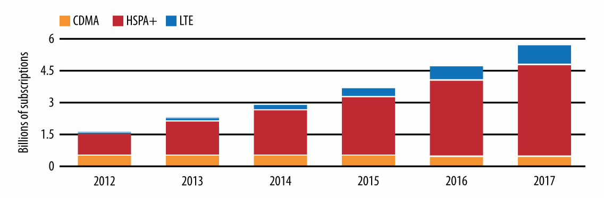

图 7-2 HSPA+ 和 LTE 在北美的趋势预测

出于各种原因，北美是采用 LTE 的领导者：目前的行业预测显示，美国和加拿大的 LTE 用户数量在 2016 年超过了HSPA（图7-3）。然而，北美 LTE 采用率似乎比其他大多数国家显得更为激进。在全球范围内，HSPA+ 将成为当前十年主流的移动无线技术。

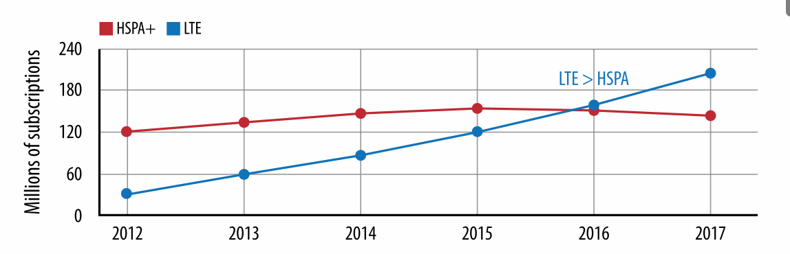

图 7-3 北美地区：美国和加拿大  HSPA+ 和 LTE 的增长预测

**Note**

> 虽然许多人最初会对采用 HSPA+ 与 LTE 的趋势感到惊讶，但这并不是无法预测的结果。它可以说明重要的一点：从新的无线标准的第一个规范到实际可用的主流无线网络大约需要十年时间。
>
> 预测一下，到 21 世纪 20 年代早期，我们将会认真谈论 LTE-Advanced！不幸的是，部署新的无线电基础设施是一项昂贵而耗时的建议。

## 建设多代并存的未来

水晶球凝视是我们行业一个危险的做法。然而到目前为止，我们已经足以对现有的移动网络以及几年后的可能做出合理的预测。

首先，无线标准正在迅速发展，但这些网络的部署既费钱又耗时。此外，网络一旦部署，必须长期运行来收回成本，并保持现有的在线用户数量。换句话说，虽然在 4G 经过了大量的炒作和营销，但是老一代网络仍将运行十年以上。移动网络的建设需要相应规划。

**Note**

> 具有讽刺意味的是，虽然 4G 网络显着改进了 IP 数据传输，但 3G 网络在处理老式语音流量方面仍然更有效率！ 旨在通过 4G 实现高效可靠的语音传输的 LTE 语音技术（VoLTE）目前正在积极发展，但目前的大部分 4G 网络仍然依靠较旧的电路交换基础设施进行语音传送。

因此，当构建移动应用程序时，我们无法针对单一类型或一代的网络，或者更糟的是，无法获知具体的吞吐或延迟性能。正如我们所看到的那样，任何网络的实际性能都是随着部署版本，基础设施，无线电环境等十几个因素高度可变的。我们的应用程序应该适应网络中不断变化的条件：吞吐，延迟甚至无线连接的可用性。用户随时随地可以根据可用的覆盖范围和信号强度在多代网络（LTE，HSPA +，HSPA，EV-DO，甚至 GPRS Edge）之间进行转换。如果应用程序无法解决这个问题，那么就会影响到用户体验。

好消息是 HSPA+ 和 LTE 的采用率增长的非常快，这使得全新的高吞吐和延迟敏感型应用成为了可能。两者在吞吐量和延迟方面都有了显著的提升（表7-6）：真实环境中数 Mbps 的吞吐量，以及 100 毫秒的延迟使得它们与许多家庭和办公室的 WiFi 网络相当。

项目|HSPA+|LTE|LTE-Advanced
---|---|---|---
峰值上行速率(Mbit/s) | 168 | 300 | 3,000
峰值下行速率(Mbit/s) | 22 | 75 | 1,500
最大 MIMO 流 | 2 | 4 | 8
理想连接延迟(ms) | < 100 | < 100 | < 50
激活延迟(ms) | < 50 | < 50 | < 10
用户面单路延迟(ms) | < 10 | < 5 | < 5

表 7-6 HSPA+, LTE, 与 LTE-Advanced 之间对比

虽然 4G 无线性能通常可以与 WiFi 或有线宽带相比，但我们不可以将它们视为相同的环境，它们绝对不同。

例如，大多数用户和开发人员期望设备永久连接到互联网，并随时对用户输入或输入数据包进行即时反应。这个假设在有线的世界中成立，但对于移动网络绝对不正确。实际情况的限制，如电池寿命和设备能力意味着我们必须根据移动网络的限制来设计我们的应用程序。让我们深入一下这些差异。

> 用户面单路延迟
>
> 用户面单向延迟是由 LTE 标准规定的用于无线设备中可用分组与无线电塔相同的可用分组之间的单向传输所需的时间。换句话说，当设备处于高功率连续接收状态时，它意味着无线传输第一跳的单向延迟。每个应用包都会产生这个开销，没有简化方式。

# 设备特性和功能
人们经常忘记掉部署无线电网络只是方程的一边。毫无疑问的是，不同制造商和发布日期的设备的特性往往不同：CPU 速度与核心数量，可用内存大小，存储容量，GPU等。这些因素都将影响设备与应用程序的整体性能。

然而当涉及到网络性能时，即使考虑了所有的变量，还有一个部分经常被忽略掉：无线电功能。具体来说，用户手持的设备必须能够利用完成部署的无线电基础设施！运营商可以部署最新的 LTE 基础架构，但是为早期版本设计的设备可能根本无法使用它，反之亦然。

## 用户设备（UE）类别
3GPP 和 3GPP2 标准都在不断发展和提高无线电接口要求：调制方案，天线数量等。为了可以在任何网络环境中都可以获得最佳性能，设备还必须满足各种类型的网络所指定的用户设备（UE）类别要求。事实上，每个版本通常都有多个 UE 类别，每个类别提供的无线电性能差别巨大。

一个显而易见的重要问题是，为什么会这样？答案依旧十分简单：成本。可用类别的多样性使得设备多样化，提供各种价格的设备给价格敏感的用户并且适应当地部署的网络环境。

仅 HSPA 标准便指定了超过 36 种的UE类别！因此，仅仅说“支持HSPA的设备”（表7-7）是不够的 - 你需要阅读细则。例如，假设无线网络能够达到 42.2Mbps 的吞吐量，您需要一个类别 20（2x MIMO）或类别 24（双单元）的设备来发挥网络性能。最后，更令人困惑的是，类别 21 的设备无法保证比类别 20 的设备的吞吐量更高。

3GPP 版本|类别|MIMO|峰值速率(Mbit/s)
---|---|---|---
5|8|—|7.2
5|10|—|14.0
7|14|—|21.1
8|20|2x MIMO|42.2
8|21|Dual-cell|23.4
8|24|Dual-cell|42.2
10|32|Quad-cell + MIMO|168.8

表 7-7 3GPP HSPA 用户设备类别样例

类似地，LTE 标准也定义了一组用户设备类别（表7-8）：高端智能手机可能是 3-5 类设备，但也可能与许多 1-2 低类设备共享网络。更高的 UE 类别需要 4 倍甚至 8 倍的 MIMO，它们更可能使用在专业设备中 - 天线的增加意味着功耗的提高，这对您的口袋里的东西可能不太实用！

3GPP 版本|类别|MIMO|峰值下行速率(Mbit/s)|峰值上行速率(Mbit/s)
---|---|---|---|—————
8|1|1x|10.3|5.2
8|2|2x|51.0|25.5
8|3|2x|102.0|51.0
8|4|2x|150.8|51.0
8|5|4x|299.6|75.4
10|6|2x or 4x|301.5|51.0
10|7|2x or 4x|301.5|102.0
10|8|8x|2998.6|1497.8

表 7-8 LTE 用户设备类别

**Note**
> 实际上，早期 LTE 部署时大多针对 1-3 类设备，早期 LTE-Advanced 网络将重点放在第 3 类设备上。

如果您拥有 LTE 或 HSPA+ 设备，您是否知道它的类别？弄明白设备类别后，你知道你的网络运营商运行哪个 3GPP 版本么？两者匹配才能获得最佳的性能表现。否则，您将会受到网络或者设备的限制。

>**解密移动设备的无线电规范**
>
>如果您曾阅读过移动设备的技术规格，无疑您将会注意到有关连接部分的频率和技术类型长时间混乱的列表。那么现在我们的知识足以解密这个清单！例如，让我们来看看 Google Nexus 4 的规范：
>
>1. GSM/EDGE/GPRS (850, 900, 1800, 1900 MHz)
>2. 3G (850, 900, 1700, 1900, 2100 MHz)
>3. HSPA+ 42
>
>第一行告诉我们，该设备可以使用具有数百 Kbit/s 峰值速率的 GPRS（2.5G）和 EDGE（2.75G）在 2G 网络上运行。频率列表展示了可用的频段以适应世界各地的不同规定和网络环境。
>
>第二行的内容与第一行类似，除了它没有展示有关 3G 峰值吞吐量方面的数据。但这正是第三行所展示的：HSPA+ 表示手机可以在 3.75G 网络上运行，“42” 告诉我们它是具有 MIMO 的 20 类设备，或者下行速率为 42.2Mbps 的双单元 24 类设备，也就是说，如果网络允许的话。事实上，Nexus 4 是双单元 24 类设备。
>
>最后，这款手机不具备 LTE 能力; 它还需要另外的无线电接口来接收 2G 或 3G 之外的网络。许多手机已经是小型化的奇迹，但是更令人吃惊的是大多数现代手机不只有一个天线，它们往往都有两到四个！

# 无线电资源控制（RRC）

3G 和 4G网络都有具有有线甚至 WiFi 网络都不具有的独特功能。无线电资源控制器（RRC）用于管理正在使用的设备和无线电基站之间的所有连接（图7-4）。了解 RRC 存在的意义，以及它如何影响移动网络上每个设备的性能对于构建高性能移动应用至关重要。RRC 直接影响到设备的延迟，吞吐量和电池寿命。

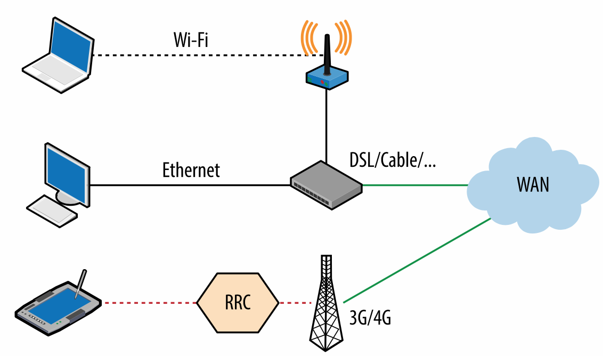
图 7-4 无线电资源控制

当使用诸如以太网电缆的物理连接时，您的计算机直连到永久在线的网络链路，允许此连接的任意一端随时发送数据包;这是延迟最小的情况。如[从以太网到无线局域网](https://hpbn.co/wifi/#from-ethernet-to-a-wireless-lan)所展示的那样，WiFi 标准遵循类似的模式，每个设备都可以在任意时刻传输数据。这在最佳情况下可以实现延迟最小，但是由于使用共享无线电介质，多活动用户可能导致高冲突率和不可预测的性能。此外，因为任何 WiFi 连接双方可以随时开始发送数据，所有另一端也必须时刻准备好接收数据。天线始终处于开启状态，这消耗了大量能量。

实际上，始终保持 WiFi 活跃的消耗太高了，因为在大多数设备上电池容量有限。因此，WiFi 提供降低功耗的优化，接入点周期性广播传送业务指示消息（DTIM）用来表明它将在之后立即给某些客户端的发送数据。反过来，客户端可以监听 DTIM 帧作为准备接收数据的标志，否则天线可以休眠到下一个 DTIM 传输周期。这可以降低电池使用量，但会增加额外的延迟。

**Note**
> 即将推出的 WiFi 多媒体（WMM）标准将通过新的节能机制（如 NoAck 和 APSD（自动节电传送））来进一步提高 WiFi 设备的电源效率。

其中揭示了 3G 和 4G 网络的问题：网络效率和能耗。或者说，由于移动设备受到电池容量的限制，以及大量活跃用户需要高网络效率的事实。这就是 RRC 存在的意义。

顾名思义，RRC 负责分配谁在何时连接，分配带宽，所使用的信号功率，每个设备的能源状态以及十几个其他变量的调度。简单来说，RRC 是无线接入网络的大脑。想通过无线信道发送数据？您必须首先请求 RRC 为您分配一些无线资源。从互联网接收数据？RRC 将通知您何时接收数据包。

好消息是网络负责所有 RRC 工作。坏消息是，您不能完全通过 API 来控制 RRC。如果您想要优化 3G 和 4G 网络的应用，那么您需要注意并在 RRC 所施加的限制内进行优化。

**Note**
RRC 存在于无线网络内。在 2G 和 3G 网络中，RRC 在核心运营商网络中。为了提高性能并减少协调延迟在， 4G 中，RRC 逻辑已经被直接移动到无线电塔（eNodeB）中。

## 3G, 4G, 和 WiFi 的功耗要求
天线是任何手机功耗最大的组件之一。事实上，激活状态下屏幕是消耗更多电量最多的部件。在实践中，屏幕在大多数情况下处于关闭状态，而天线必须保持仿佛“永远在线”的体验，以便用户可以随时访问。

始终保持天线的活跃可以实现这一目标，但是即使使用最新的电池技术，这样做也会在几个小时内耗尽电池。更糟糕的是，3G 和 4G 标准的最新迭代支持了并行传输（MIMO，Multicell 等），这相当于需要同时为多个天线供电。实践中必须保持激活天线以数据交互的降低延迟与实现合理的待机表现之间的平衡。

如何比较不同的技术，哪个更有益于电池寿命？这没有一个统一的答案。对于 WiFi 来说，每个设备通常在 30-200mW 的范围内调整发射功率。相比之下，3G/4G 无线电的发射功率由网络管理，空闲状态时功耗低至 15mW。然而，为了提高覆盖范围与解决干扰，当在高功率状态下传输时，需要 1,000-3,500mW 的功率！

实践中，在传输大量数据时，如果信号强度很好，WiFi 通常会更有效率。但如果大多数情况下设备闲置，那么 3G/4G 的效率更高。理想情况下，为获得最佳性能我们希望在不同连接类型之间进行动态切换。然而至少目前为止还没有这样的机制。这是行业和学术界的一个活跃的研究领域。

那么电池和电源管理如何影响网络性能呢？增大信号功率（[Signal Power](https://hpbn.co/introduction-to-wireless-networks/#signal-power)）是提高高吞吐量的主要手段之一。然而，高发射功率消耗大量能量，因此为了更好的电池寿命，不能无限制的提高发射功率。类似地，关闭天线也可以中断到无线电塔的链路，这意味着在开始新的数据传输时必须首先交换一系列控制消息以重新建立上下文，这会增加数十甚至数百毫秒的延迟。

设备的电源管理配置文件可以直接影响吞吐量和延迟性能。事实上，关键在于 3G 和 4G 网络的无线电功率管理由 RRC 控制：它不仅告诉您何时进行通信，而且还会告诉您发射功率和何时进入不同的状态。

## LTE RRC 状态机
无线电塔控制了由它提供服务的每个 LTE 设备的无线电状态。实际上，3GPP 标准明确规定了一个状态机，它描述了连接到网络的每个设备的电源状态（图7-5）。网络运营商可以对修改触发状态转换的参数，但是所有 LTE 网络的状态机都是相同的。

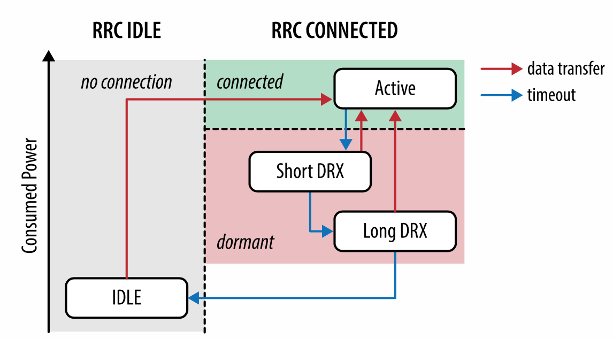

图 7-5 LTE RRC 状态机

*RRC 空闲*

低功率状态（<15 mW），只能监听流量。运营商网络没有给客户端分配无线资源。

*RRC 连接*

高功率状态（1000-3500mW），传输数据或等待数据，专用无线电资源由无线电网络分配。

空闲的设备仅监听控制信道广播，例如入站流量的寻呼通知或连接。若要进入连接状态下，需要网络为客户端建立上下文并分配资源。

处于空闲状态时，设备无法发送或接收任何数据。为了转变到“已连接”状态，它必须首先通过收听网络广播来同步网络，然后向 RRC 发送请求。建立这种协商可能需要几个轮次，并且 3GPP LTE 规定该状态转换需要小于等于 100ms。在 LTE-Advanced 中进一步减少到50毫秒。

一旦处于连接状态，在无线电塔和 LTE 设备之间已经建立了网络上下文，并且可以传送数据。然而，一旦任意一方完成预期的数据传输，RRC 如何知道何时将设备转换到低功率状态？有陷阱的问题 - 它不做这件事情！

IP 流量是突发的，经过优化的 TCP 连接是长期存在的，并且 UDP 流量不提供“传输结束”指示符。因此，与[连接状态超时](https://hpbn.co/building-blocks-of-udp/#connection-state-timeouts) 描述的 NAT 连接状态超时解决方案不同，RRC 状态机依赖一系列计时器来触发 RRC 状态转换。

最后，由于连接状态功耗过高，所以有多个可用的子状态（图7-5），以提高运行效率：

*持续接收*

最高功率状态，建立网络上下文，分配网络资源。

*短期间断接收（短DRX）*

建立网络环境，无分配网络资源。

*长期间断接收（长DRX）*

建立网络环境，无分配网络资源。

在高功率状态下，RRC 通过无线接口创建用于接收和发送数据的设备的预约，并通知设备这些何时发送，强制使用的发射功率，调制方案等十几个其他因素。然后，如果设备在配置的时间段内已经空闲，则转换到短 DRX 功率状态，其中保持网络上下文，但是不分配特定的无线电资源。当处于短 DRX 状态时，设备仅监听来自网络的周期性广播，这减少了电池使用 - 与 WiFi 中的 DTIM 间隔不同。

**什么是无线电资源分配**
> 与大多数其他现代无线标准一样，LTE 存在共享的上行链路和下行链路无线电信道，其接入由 RRC 控制。当处于连接状态时，RRC 通知设备这些何时发送，强制使用的发射功率，调制方案等十几个其他因素。

如果移动设备没有RRC的这些资源的分配，则它不能发送或接收任何用户数据。因此，当处于DRX状态时，该设备与RRC同步，但没有向其分配上行链路或下行链路资源：该设备为“半醒”。

如果空闲时间过长，则转换到与短 DRX 状态大体相同的长 DRX 状态，但是处在长 DRX 状态设备在唤醒接受广播之前会休眠较长的时间（图7-6 ）。

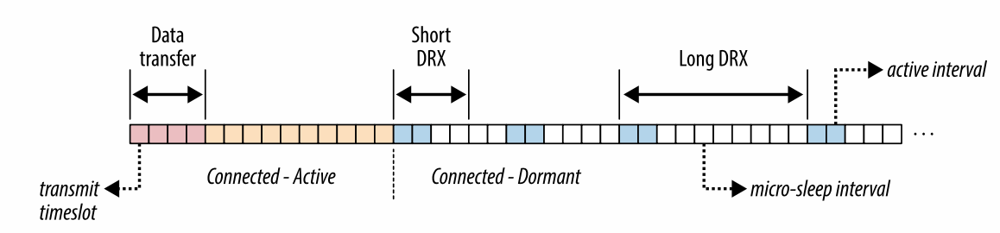

图 7-6 间断接收：短 DRX 与长 DRX

如果无线电在短期或长期 DRX（休眠）状态时网络或移动设备必须传输数据会发生什么呢？设备和 RRC 必须首先交换控制消息以协商何时发送与何时接收无线电广播。对于LTE，该协商时间（“休眠到连接”）规定为小于 50 毫秒，LTE-Advanced 进一步降低到低于 10 毫秒。

那么这在实践中意味着什么？根据无线电设备的哪个电源状态，LTE 设备首先需要等待 10 到 100 毫秒的时间（表7-9），以便与 RRC协商所需的资源。之后，应用数据可以通过无线链路，穿越运营商的网络，然后发送到公共互联网。规划这些延迟，特别是在设计延迟敏感应用程序时，“不可预测的性能”与经过优化的移动应用之间的差别很大。

状态| LTE | LTE-Advanced
————|————|————
空闲到连接延迟 | < 100 ms | < 50 ms
DRX 到连接延迟 | < 50 ms | < 10 ms
用户面单向延迟| < 5 ms | < 5 ms

表 7-9. LTE 与 LTE-Advanced RRC 延迟

## HSPA 与 HSPA+ (UMTS) RRC 状态机

好消息是 LTE 与 LTE-Advanced 之前一代的 3GPP 网络具有非常相似的 RRC 状态机，也由无线电网络负责维护。坏消息是前几代的状态机有点复杂（图7-7），延迟更高。事实上，LTE 提供更好的性能正是由于简化了架构并改进了 RRC 状态转换的性能。

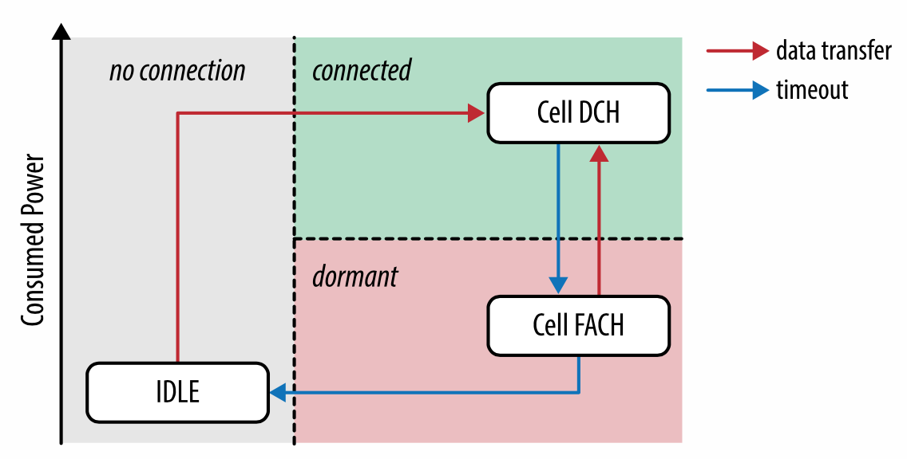

图 7-7. UMTS RRC 状态机: HSPA, HSPA+

*空闲*

类似于 LTE 中的空闲状态。设备天线处于低功率状态，只监听来自网络的流量。没有给运营商网络内的客户端分配无线资源。

*DCH*

在连续接收时类似于的 LTE 连接模式。设备处于高功率状态，网络资源被分配用于上游和下游数据传输。

*FACH*

中等功率状态，功耗明显低于 DCH。没有专用网络资源，但是仍然能够通过共享低速信道（速度通常低于 20Kbps）传输少量的用户数据。

空闲和 DCH 状态几乎与 LTE 中的空闲与连接状态相同。然而，FACH 状态只存在于 UMTS 网络（HSPA，HSPA +），并且允许使用用于小数据传输的公共信道：慢，稳定并且功耗大约是 DCH 状态的一半。在实践中，该状态设计用来处理非交互式流量，例如由许多后台应用程序进行的定期轮询和状态检查。

毫不奇怪的是，从 DCH 到 FACH 的转换由定时器触发。不过，一旦处于 FACH 状态时，如何转回 DCH 状态？每个设备维护待发送数据的缓冲区，并且只要缓冲区不超过网络配置的阈值，通常是 100 到 1,000 字节之间的任意值，则设备可以保持在中间状态。最后，如果在 FACH 中一段时间​​内没有数据传输，则转换到空闲状态。

**note**
> 提供两个中间状态（短 DRX 和长 DRX）的 LTE 不同的是 UMTS 设备只有一个中间状态：FACH。然而，即使 LTE 提供了理论上更好的功耗控制，无线电自身倾向于在 LTE 设备中消耗更多能量;更高的吞吐量的代价是增加电池消耗。因此，LTE 设备仍然比其前一代的 3G 设备具有更高的功耗。

抛开电源状态的不同，3G 网络和 LTE 之间的最大差异可能是状态转移的延迟。LTE 从空闲到连接状态的转变需要补到一百毫秒，而相同的从空闲状态到 DCH 的转换可能需要两秒钟，并且在 3G 设备和 RRC 之间需要数十个控制消息！FACH 相较于 DCH 来说也不是那么好，需要高达一秒半的时间。

好消息是，最新的 HSPA+ 网络已经在这方面取得了重大进展，与 LTE 有了可比性（表7-6）。然而，我们不能指望在任何地方访问 4G 或 HSPA+ 网络;老一代的 3G 网络至少将持续十年。因此，当通过 3G 接口访问网络时，所有移动应用都应该对数秒的 RRC 延迟有所准备。

## EV-DO (CDMA) RRC 状态机

虽然诸如 HSPA，HSPA+ 和 LTE 之类的 3GPP 标准是全球主要的网络标准，牢记基于3GPP2 CDMA的网络依然是十分重要的。EV-DO 网络的增长曲线可能看起来相对平缓，但即使如此，目前到 2017 年的行业预测显示 CDMA 仍有近五十亿个用户。

无论标准的差异如何，基于 UMTS 和基于 CDMA 的网络的基本限制是相同的：电池电量是有限的，天线的功耗较高，提升网络效率是十分重要的。因此，CDMA 网络也具有控制每个设备状态的 RRC 状态机（图7-8）。

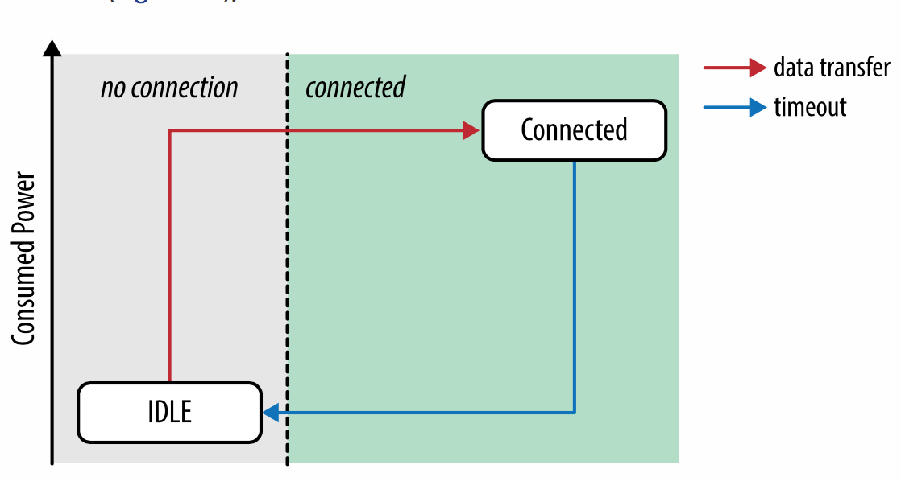
图 7-8 CDMA RRC 状态机： EV-DO (Rev. 0—DO Advanced)

*空闲状态*

类似于 3GPP 标准中的空闲状态。设备天线处于低功耗状态，只监听来自网络的流量。运营商网络内的客户端没有分配无线资源。

*连接状态*

类似于 HSPA 中的 DCH 状态和 LTE 中的连接状态。该设备处于高功率状态，并为上游和下游数据传输分配网络资源。

这绝对是所有我们解释的 RRC 状态机中最简单的：分配网络资源的高功率状态或空闲状态。此外，所有网络传输都需要转换到连接状态，其延迟类似于 HSPA 网络：数百到数千毫秒，随着基础架构的不同而变化。没有其他中间状态，通过配置超时来转换回空闲状态。

## 低效的周期传输

超时控制状态转换的一个重要后果是无论版本或底层标准如何，构建网络访问模式非常简单，以及优质带来的较差的交互式用户体验和较差的电池性能。事实上，在低功耗状态时你所要做的只是等待足够长的时间，然后触发网络访问来强制进行 RRC 转换！

为了说明这个问题，我们假设设备处于 HSPA+ 网络，配置网络在 10 秒钟的无线电活动之后从 DCH 转移到到 FACH 状态。接下来，我们运行一个每 11 秒周期传输数据（例如实时分析产生的数据）的应用程序。结果是什么？该设备可能会传输数百毫秒数据，然后空闲尽管处在高功率模式。更糟糕的是，它将转变为低功耗状态并在数百毫秒后被唤醒，延迟和电池性能的都是最坏情况。

无论多么小的无线传输都会迫使转向高功率状态。然后，一旦传输完成，无线电将保持在这个高功率状态，直到触发休眠计时器（图7-9）。实际数据传输的大小不影响计时器。此外，设备在能够返回到空闲之前也会经过几个中间状态的循环。

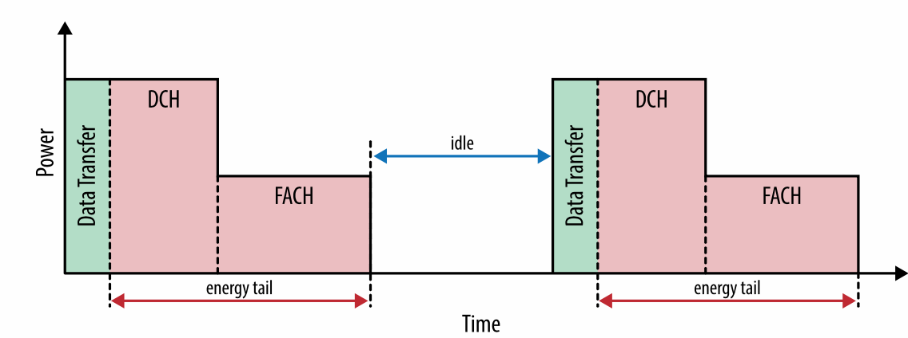
图 7-9 由于 DCH > FACH > IDLE 转换带来的能耗尾巴

计时器驱动的状态转换所带来的“能耗尾巴”使得周期传输在移动网络上的网络访问模式非常低效。首先，您必须承担状态转换的延迟成本，然后发生状态转移，最后，无线电空闲，浪费能源，直到所有计时器触发，设备才能返回到低功耗状态。

>**0.2％ 的数据消耗了 46% 的电池**
>
> AT&T实验室发表了一篇出色的研究论文（“移动应用的资源占用分析”），其中分析了一些流行的移动应用的网络和电池效率。在这些应用中，潘多拉作为移动网络周期性网络传输效率低下的一个很好的案例研究。
>
> 每当潘多拉用户播放歌曲时，整个音乐文件将由应用程序从网络流式传输一次，这是正确的行为：尽可能多地获取数据，然后尽可能长时间关闭天线。然而，在音乐传输之后，应用将每隔 60 秒周期性发送用户分析数据。结果如何？分析数据占总数据的 0.2％，占应用总功耗的 46％！
>
> 分析指标传输量很小，但是由 RRC 状态转换引起的能耗尾巴使得天线激活时间更长，不必要地浪费了 46％ 的电池。通过将分析数据合并为更少的请求，或者当天线已经激活时发送用户数据，我们可以减少不必要的能耗尾巴，几乎可以降低应用一半的功耗！

# 端到端运营商架构

既然我们已经熟悉了 RRC 和设备的功能，那么聚焦到运营商网络端到端的整体架构会是非常有意义的。我们的目标不是成为其中几十个组件和功能的专家，而是突出对数据流经运营商网络有直接影响的组件，以及弄清它将如何影响我们应用的性能。

运营商网络中各种逻辑和物理组件的具体设施和名称取决于部署网络的版本和类型：EV-DO，HSPA，LTE等。然而，所有它们之间许多相似之处，在本章中我们将对 LTE 网络的高级架构进行研究。

为什么是 LTE 呢？首先，它是新运营商最有可能部署的架构。第二，甚至更重要的是，LTE 简化了架构：更少的组件和更少的依赖也可以提高性能。

## 无线接入网（RAN）

无线电接入网络（RAN）是每个运营商网络的第一大逻辑组件（图7-10），其主要职责是调节无线电信道的访问，并传输往来用户设备的数据包。事实上，它是由 RRC 控制并调节的组件。在 LTE 中，每个无线电基站（eNodeB）承载 RRC，它维护 RRC 状态机，并为其单元中的每个活动用户分配资源。

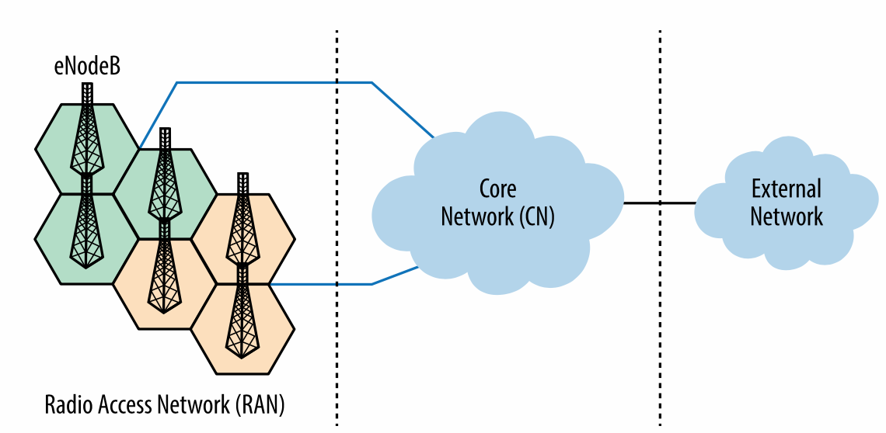

图 7-10. LTE 无线接入网: 跟踪区域与 eNodeB

每当用户收到来自附近单元的更强的信号，或者如果它当前的单元过载，则它可能被交给相邻的塔。然而，虽然这听起来很简单，但是切换过程导致了每个运营商网络中大量的额外复杂性。如果所有用户总是处于相同的固定位置，并且保持在单个塔的范围内，则静态路由拓扑就足够了。然而，众所周知的是根本不是这样：用户是移动的，一定会在塔之间移动，移动过程不应该中断任何语音或数据流量。毫无疑问，这是一个非常重要的问题。

首先，如果用户的设备可以与任何无线电塔相关联，那么我们怎么知道将传入的数据包传到哪里？当然，没有任何魔法：无线接入网必须与核心网络进行通信，以跟踪每个用户的位置。此外，为了实现透明切换，它还必须能够在不会中断任何现有的用户发起的语音和数据会话的情况下，动态地更新其现有的隧道和路由。

>**note**
>在 LTE 中，可以在几百毫秒内完成塔到塔的切换，这将在物理层的数据传输中产生短暂的暂停，但是该过程对于用户和在其设备上运行的所有应用来说是完全透明的。在早期的一代网络中，这个过程可能需要几秒钟的时间。

但是，我们还没结束。无线电切换可能是频繁发生的，特别是在高密度城市和办公环境中，并且即使当设备空闲时，用户设备也需要连续执行小区切换协商，这会消耗设备大量能源。因此，增加了额外的间接层：一个或多个由运营商网络定义的塔的逻辑分组被称为“跟踪区域”。

核心网络必须知道用户的位置，但通常它只知道跟踪区域而不知道特定的当前正在为用户提供服务的塔 - 我们将看到这对入站数据包的延迟有重要的影响。反过来，运行设备在相同的跟踪区域内的塔之间移动没有开销：如果设备处于空闲 RRC 状态，则设备或无线电网络不会发出通知，从而节省手机电量。

## 核心网（CN）
核心网络（图7-11）也被称作 LTE 中的分组核心演进（EPC），负责数据路由，账户和策略管理。简单来说，这是将无线电网络连接到公共互联网的部分。

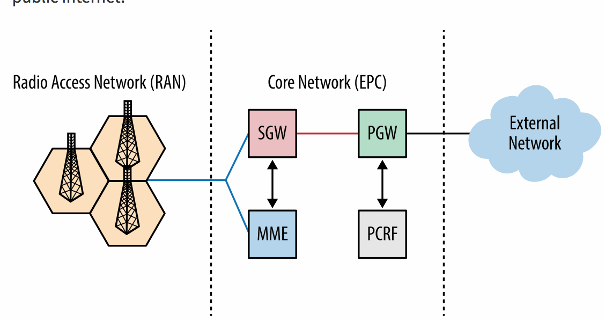
图 7-11 LTE 核心网（EPC）: PGW, PCRF, SGW 和 MME

首先，我们有包网关（PGW），它是将移动运营商与公共互联网连接起来的公共网关。 无论采用什么协议，所有外部连接终止于 PGW。当移动设备连接到运营商网络时，设备的IP 地址由 PGW 分配和维护。

运营商网络内的每个设备都有一个内部标识符，它和 IP 地址无关。反过来，一旦 PGW 接收到一个数据包，便将其封装并通过 EPC 隧道传输到无线接入网络。LTE 将流控制传输协议（SCTP）用于控制面流量，GPRS 隧道协议 (GTP) 与 UDP 结合起来用于其他数据。

> **物理层与应用层连通性**
>
>设备的 IP 地址由 PGW 分配和维护有着重要意义。首先，这意味着无线设备可以轻松地与多个 IP 地址相关联。反过来，如果 IP 地址非常紧缺，那么多个设备可以共享相同的 IP 地址，但是为来往流量分配不同的端口：PGW 充当 NAT。其实后一种情况是很常见的。相同的运营商 IP 地址可以分配给其网络内的数十甚至数百个设备。
>
>因此，来自同一设备的流量可以源于多个公共运营商的 IP 地址。看到相同的客户端资源请求来自不同 IP 时不要惊讶！使用 IPv6 时这种行为可能会改变，每个设备最终可能会获得唯一的 IP 地址。话虽如此，如今很少运营商支持 IPv6，IPv6 的推出和采用仍然十分缓慢。
>
>然而，除了 IP 分配之外，由于所有连接终止于 PGW，设备无线状态不受应用层连接性的影响：在无线电网络中断开无线电上下文会终止设备与无线电塔之间的物理无线连接，但这不影响任何 TCP 或 UDP 会话的状态。设备天线可以空闲，没有到本地无线电塔的连接，而建立的连接由 PGW 维护。
>
> 一旦必须要传输应用数据，可以没有副作用的重新建立物理无线链路，除了重新建立无线电上下文所需要的 RRC 协商延迟。

PGW 还执行所有常见的策略，例如包过滤和检查，QoS 分配，DoS 保护等。策略和计费规则功能（PCRF）组件负责为包网关维护和执行这些规则。 PCRF 是一个逻辑组件，意味着它可以是 PGW 的一部也可以独立存在。

现在，我们假设 PGW 已经从公共互联网接收到其网络上的一个移动设备的数据包;它将数据发送到哪里？PGW 不知道用户的实际位置，也不知道无线接入网络内的不同跟踪区域。下一步由服务网关（SGW）和移动管理实体（MME）负责。

PGW 将其所有数据包发送到 SGW。然而 SGW 可能不知道用户的确切位置这使得问题更加复杂。实际上，这个功能是 MME 的核心职责之一。移动管理实体组件实际上是用户数据库，它管理网络上的每个用户的所有状态：网络上的位置，帐户类型，计费状态，启用的服务以及所有其他用户元数据。用户在网络内的位置改变时，MME 收到位置更新; 用户打开电话时，MME 进行身份认证等等。

因此，当数据包到达 SGW 时，向 MME 查询用户位置。然后，一旦 MME 返回跟踪区域和目标区域信号塔 ID，如果不存在现存的到信号塔的连接，SGW 可以建立新连接，并将用户数据发送到无线接入网络。

简单来说就是这样。这种高层次架构在所有版本的移动数据网络中都是相同的。逻辑组件的名称可能不同，但从本质上说，所有移动网络都需要遵循以下工作流程：

1. 数据到达外部包网关，它将核心网络和公网连接起来。
2. 在包网关上应用一组路由和数据包策略。
3. 数据从公共网关发送到一个或多个服务网关，它作为无线网络内设备的移动锚点。
4. 用户数据库服务负责网络上每个用户的身份验证，计费，服务提供和位置跟踪。
5. 一旦确定了无线网络内用户的位置，数据就从服务网关发送到适当的无线电塔。
6. 无线电塔与目标设备之间进行必要的资源分配和协商，然后通过无线电接口传送数据。

>**LTE核心网中简化和统一的架构**
>
>LTE 的主要特征之一是其基于 IP 专用架构的新分组核心演进（EPC）网络，它设计用于通过统一的网络传输语音和数据。该设计使得运营商的运行成本更低，但对网络的性能要求也更高：语音要求低延迟，4G 要求更高的吞吐量。
>
>EPC 如何实现这些目标呢？大量的架构改进，但与上一代网络的主要区别之一是 LTE 核心网络架构的简化：删除一些组件，其他组件合并成更少的逻辑组件，并且大量的决策下放到接入网。
>
>例如，在 LTE 中，RRC 由无线电塔（eNodeB）维护，而在较早的几代中，RRC 在网络更核心的位置（服务网关）管理，网络内的所有控制流量（服务网关处）增加了额外的延迟和性能瓶颈。

## 回程容量与延迟

所有逻辑和物理组件之间的连通性和容量是任何运营商网络性能的一个重要因素。LTE 无线接口在用户和无线电塔之间可以达到高达 100Mbps 的速率，但是一旦信号被无线电塔收到，则必须必须有足够的容量用于通过运营商网络传送到实际目的地。另外，必须要牢记单个信号塔塔需要同时为多个活动用户提供服务！

提供真正的 4G 体验对于部署新无线网络并不是一个简单的问题。核心网络也必须升级，EPC 和无线网络之间必须有足够容量的链路，所有的 EPC 组件必须能够实现比之前任何一代网络低得多的延迟与更高的数据速率。

**note**
>在实践中，单个无线电塔可以服务多达三个附近的小区，活跃用户的数量可以轻易地达到数百个。为了每个用户 10Mbps 的数据速率要求，每个塔架需要专用的光纤链路！

不用说，所有这些要求使得 4G 网络对于运营商而言十分昂贵：可以到达所有的无线电塔的光纤，高性能路由器等。实际上，网络的整体性能受无线接口限制的情况较为少见，而通常的瓶颈是运营商网络的可用回程容量。

这些性能瓶颈不是我们作为移动应用的开发人员所能控制的，但是它们再一次说明了一个重要的事实：IP 网络的架构基于尽力而为的交付模式，这不能保证终端的表现优秀。一旦我们消除了第一跳（无线接口）中的瓶颈，瓶颈将转移到网络中下一个最慢的链路，无论是在运营商网络内还是在通往目的地路径上的其他地方。回顾我们早前关于有线网络中最后一英里延迟的讨论可以发现其实这并不是什么新鲜事。

通过 4G 接口连接并不意味着您可以保证无线接口提供最大的吞吐量。相反，我们的应用必须适应运营商网络和公共互联网之中无线信道不断变化的网络环境。

# 移动网络的数据包流

设计移动网络应用的主要问题之一是延迟的高度变化。那么现在我们已经讲述了移动网络的 RRC 和高级架构，终于我们可以将这些连接起来，观察端到端的数据包流，这也解释为什么会存在这种延迟变化。更好的是我们将看到许多变化实际上是可预测的！

