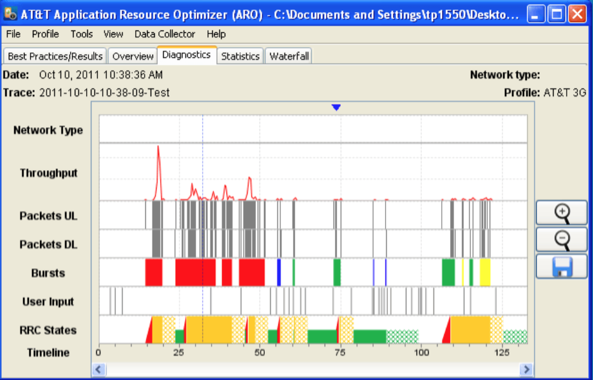
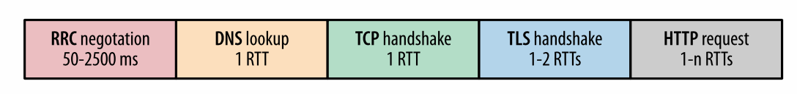

# 优化移动网络
首先，通过 Keepalive 连接，使服务器距客户端更近，优化 TLS 部署，以及我们所涵盖的所有其他协议优化来降低延迟在移动应用中显的更为重要，延迟和吞吐量总是值得优化的。同样的，所有 Web 应用性能最佳实践同样适用。向前翻翻[优化 Web 性能](https://hpbn.co/primer-on-web-performance/)。

然而，移动网络对于性能优化也有一些新的独特的要求。设计移动应用需要仔细规划和考虑设备形式对内容呈现的限制，无线接口独特的性能特性，电池寿命的影响。这三个是不可分割的。

也许是因为有着诸如响应式布局的表示层最容易控制，它往往受到最多的关注。然而，大多数应用的不足通常是由于对网络性能的不正确的设计假设：应用协议是相同的，但物理传递层之间的差异强加了一些限制，如果不明白这些将导致缓慢的响应时间，延迟变化巨大，最终为用户带来较差的体验。糟糕的网络决策也将对设备的电池寿命产生极大的负面影响。

这三个限制没有通用的解决方案。表示层，网络和电池寿命表现都有最佳实践，但经常出现问题。这取决于您，并需要在需求中找到平衡。可以肯定的是：简单地忽略其中的任何一个因素都不会让你走的很远。

考虑到这一点，我们不会对表示层做过多阐述，因为每个平台和应用类型都有所不同，现在有许多专门针对这个问题的书籍。但是，无论制造商或操作系统如何，移动网络对于无线电和电池限制是统一的，这就是本章重点。

**note**
在本章中，“移动应用”具有其最广泛的定义：我们关于移动网络性能的所有讨论同样适用于所有原生应用以及运行在所有浏览器中的应用。

# 节省电池能源
涉及移动领域，节能是所有人关注的问题：设备制造商，运营商，应用程序开发人员以及我们应用的最终用户。当产生疑问时，或者想弄清楚为什么会有某种行为时，请问一个简单的问题：它将如何影响或改善电池寿命？事实上，这是一个很好的问题，同样审视一下你的应用中的每一功能。

移动网络的性能本质上与电池性能相关。实际上为了优化电池寿命，无线接口的物理层是专门根据如下限制特殊构建的。

1. 全功率的无线电使用可能会在数小时内耗尽电池。
2. 每一代无线电发展都会提高无线电功率的要求。
3. 无线电的功耗通常仅次于屏幕。
4. 无线电的使用相对于传输的数据量通常是非线性的。

考虑到这一点，移动应用应该旨在尽量减少对无线接口的使用。要明确的是，这并不是说你应该避免完全使用天线;毕竟我们正在构建依赖于网络连接的应用！然而，因为保持天线激活的功耗很高，所以我们的应用应该在天线激活时最大限度地传输数据，然后寻求最小化额外数据传输。

**note**
虽然 WiFi 也使用无线接口传输数据，由于 WiFi 的底层机制的不同，认识到 WiFi 与2G，3G 和 4G 移动网络在延迟，吞吐和功率配置基本上的差异是十分重要的;请参阅我们之前的讨论 [3G, 4G, 和 WiFi 的功耗要求](https://hpbn.co/mobile-networks/#3g-4g-and-wifi-power-requirements)。因此，WiFi 与移动网络的网络行为应该通常认为是不同的。

>**使用 AT&T 应用资源优化器测量电源使用**
>
>优化电源使用受到了高度重视，但大多数平台目前仍然缺乏帮助开发人员测量和优化其应用的必要工具。幸运的是，有第三方工具可以提供帮助，例如由 AT&T 开发的免费的应用资源优化器（ARO）工具包。
>
>ARO 由两个组件组成：收集器和分析仪。收集器是在后台运行的 Android 应用（在真实手机或模拟器中），并捕获传输的数据包，无线电活动以及与手机的其他交互。加载收集器，点击 Record，与应用进行一些交互，便可以捕获跟踪结果，最后将跟踪结果复制到系统。
>
>一旦有了跟踪结果，您可以使用分析仪打开它，以了解应用程序的无线状态，能源消耗和流量模式。分析仪的一个重要功能是它针对常见的性能缺陷提供建议，例如缺少压缩，数据传输冗余等。
>
>两个重要的事情值得注意：电池消耗和无线电状态是通过指定的设备型号和无线网络的类型生成的。换句话说，生成的数字不是来自正在使用的设备的精确测量值，而是基于模型中指定参数的产生估计值。这允许您导入不同的设备和网络模型并比较其能源使用 - 例如 3G 与 4G。
>
>最后，收集器只能在 Android 平台上使用，但是 ARO 分析器也可以接受 **tcpdump** 或其他兼容工具生成的任何常规数据包跟踪文件（pcap）; iOS 用户必须使用 **tcpdump** 方法。
>
>可以在 [https://hpbn.co/attaro](https://hpbn.co/attaro) 获取 ARO。

图 8-1  AT&T 应用资源优化器

## 消除周期性的和低效的数据传输

事实上，无论移动数据的传输量如何，移动无线电都会产生固定的能耗来转移到全功率状态，这告诉我们，对于能耗来说，没有像“小请求”这样的事情。周期性网络访问是移动网络性能的反模式; 查看[低效的周期传输](https://hpbn.co/mobile-networks/#inefficiency-of-periodic-transfers)。事实上，扩展这个逻辑可以得出如下规则：

1. 轮询在移动网络上非常昂贵，尽量可能减少轮训
2. 在可能的情况下，应使用推送通知。
3. 出站和入站请求应合并和汇总。
4. 应该推迟非关键性请求，直到天线处于活动状态。

一般来说，推送比轮询更有效率。然而，高频推送流也是十分耗能的。每当需要实时更新时，您应该考虑以下问题：

1. 什么是更新的最佳时间间隔，它是否符合用户期望？
2. 可以使用自适应策略取代固定的更新间隔吗？
3. 入站或出站请求可以合并和汇总成较少的网络请求吗？
4. 入站或出站请求可以延迟到以后吗？

**note**
>对于推送数据，本地应用可以访问平台特定的推送服务，尽可能使用这些服务。对于 Web 应用程序，可以使用服务器发送事件（SSE）和 WebSocket 传递来最小化延迟和协议开销。尽可能避免轮询和昂贵的 XHR 技术。

基于自适应间隔，用户偏好，甚至设备上的电池状态，将多个通知捆绑到单个推送事件中的简单聚合策略可以显着改善任何应用（特别是依赖这种类型的网络访问模式的后台应用）的性能表现。

>** Nagle 和 Efficient Server Push**
>
>TCP 爱好者将把请求聚合和绑定称为 Nagle 算法，而不是应用层重新实现！ Nagle 算法尝试将多个小型 TCP 消息合并成单个数据包，以减少协议开销和线路上的数据包数量。我们的移动应用可以从利用相同的技术。
>
>这种策略的一种简单实现方式是通过时间，数量或大小在服务器上聚合消息，而不是单独推送每个消息。更复杂一点但更有效率的策略是仅当客户端已经激活时推送更新 - 例如，延迟消息推送直到客户端发起请求或者利用了解客户端天线状态的第三方服务。
>
>例如，Android 和 Chrome 平台的 Google Cloud Messaging（GCM）等提供消息传递 API 的服务，只有当设备处于活动状态时，才会聚合消息并提供更新：服务器将其消息推送到 GCM，GCM 确定最佳的推送计划。
>
>不幸的是，今天没有跨浏览器的 API 向所有客户端提供类似 GCM 的体验。但是 W3C Push API（请参阅[http://www.w3.org/TR/push-api/](http://www.w3.org/TR/push-api/)）应该在将来会解决这个问题。

间歇性指标请求（如客户测量点和实时分析）可以轻易地抵消掉所有的电池优化。这些请求在有线甚至 WiFi 网络上大都是无害的，但在移动网络上却需要极高的成本。这些指标是否需要立即发送？您可以轻松地储存并推迟发送这些请求，直到下一次天线处于活动状态。捎带发送这些后台指标请求，并且密切注意代码中第三方库和代码的网络访问模式。

最后，虽然我们迄今为止仍然专注于功耗，但是由于 RRC 状态转换，逐步增强和增量加载等技术所需的间歇性网络访问也会带来很高的延迟！回想一下，每次状态转换都会导致在移动网络中引起数百或数千毫秒的控制面延迟 - 这对于用户发起请求和交互来讲都是十分昂贵的。

>**计算后台更新的功耗**
>
>为了说明定期轮询对电池寿命的影响，我们来做一些简单的计算。虽然数字并不精确，但在典型的 3G/4G 手机的范围内：
>
>5 瓦特时或 18,000 焦耳的电池容量(5 WH * 3600 J/Wh)
>
>天线从空闲到连接状态并转换回来消耗 10 焦耳
>
>1 分钟间隔的轮询每小时消耗600焦耳的能量（60 * 10 J）
>
>600 焦耳的能量是总电池容量的 3％（600 J/18,000J）
>
>单个应用的每时消耗可用电池容量的3％！这将使几个不重叠的轮询间隔的应用在一个中午耗尽全部电池。尽管公平地说，频繁且更新无缓存的推送的应用功耗更高。
>
>电池寿命优化和更新频率本质上是矛盾的。根据您的特定应用的需求来确定最佳策略：组合更新，自适应更新间隔，拉取与推送数据等。然后，用 ARO 或类似工具测量性能并做出相应调整。

## 消除不必要的应用保持激活

任何 TCP 或 UDP 连接的连接状态和生命周期都与设备的天线状态无关：天线可以处于低功耗状态由运营商网络维护连接。然后，当新的外部网络数据包到达时，运行商无线网络将通知设备，将设备转换到连接状态，并恢复数据传输。

为了保持连接状态，应用程序不需要保持天线“激活”。不必要的应用保持激活可能对电池寿命产生巨大的负面影响，并且由于对移动广播工作原理的误解，常常有人这么做。请参阅[物理层与应用层连接](https://hpbn.co/mobile-networks/#physical-layer-vs-application-layer-connectivity)与[移动网络的数据包流](https://hpbn.co/mobile-networks/#packet-flow-in-a-mobile-network)。

**note**
>大多数移动运营商设置了 5-30 分钟的 NA T连接超时。因此，您可能需要定期（5分钟）保持激活，以保持空闲连接不被断开。如果您发现需要频繁的保持激活，请先检查自己的服务器，代理和负载均衡配置！

# 预测网络延迟开销
对于请求资源的单个 HTTP 请求可能会在移动网络中的产生数百到数千毫秒的网络延迟。部分原因是由于高往返延迟，但我们也不能忘记 DNS，TCP，TLS 和控制面延迟（图8-2）！

图 8-2 一个简单 HTTP 请求的组成

最佳情况下，无线电已经处于高功率状态，预先解析 DNS，并且现有的 TCP 连接可用：客户端可能重用现有的连接并避免建立新连接的开销。但是，如果连接繁忙或不存在，那么我们必须在发送任何应用数据之前重新进行一些额外的往返。

为了说明这些额外的网络往返的影响，让我们假设为 4G 乐观情况下提供 100 毫秒往返时间，3.5G+ 网络 200 毫秒的往返时间：

网络类型 | 3G | 4G
--|--|--
控制面 | 200–2,500 ms | 50–100 ms
DNS 查询 | 200 ms | 100 ms
TCP 握手 | 200 ms | 100 ms
TLS 握手 | 200–400 ms | 100–200 ms
HTTP 请求 | 200 ms | 100 ms
总延迟开销 | 200–3500 ms | 100–600 ms

表 8-1 单个 HTTP 请求的延迟

在重新建立 3G 网络的无线电上下文时，无线控制面延迟增加了从数百到数千毫秒的开销！一旦天线处于活动状态，我们可能只需要两个网络往返：将主机名解析为 IP 地址，然后执行 TCP 握手。如果需要安全隧道，我们可能需要两次额外的网络往返（参见[TLS 会话恢复](https://hpbn.co/transport-layer-security-tls/#tls-session-resumption)）。最后发送 HTTP 请求，这增加了至少一个往返。

我们还没有考虑服务器响应时间或响应的大小，这可能需要几次往返，但是我们已经产生了六次往返。乘以往返时间，3G 的延迟达到了整一秒，4G 网络的延迟时间大约是半秒。

## RRC 状态转换说明
如果移动设备已经空闲了几秒钟，您应该假设并预计第一个数据包将产生数百甚至数千毫秒的额外 RRC 延迟。根据经验，一次性的控制面延迟成本对于 4G  100 毫秒，3.5G+ 为 150-500 毫秒，3G 为 500-2,500 毫秒。

RRC 专门设计用于帮助减轻天线功耗。然而，由于各种定时器，计数器的存在以及不同无线电状态转换网络所需协商的开销，电池寿命的提升往往被延迟和吞吐量的降低所抵消。然而，RRC 也是移动网络无法绕开的一部分，如果你想为移动网络构建优化的应用，你必须设计时考虑到 RRC。

快速总结一下我们学到的有关 RRC 的知识：

1. RRC 状态机对于每个无线标准是不同的。
2. RRC 状态机由每个设备的无线网络管理。
3. 当数据传送时，RRC 状态转换到高功率。
4. 网络配置超时时，RRC 状态转换到低功率。
5. （4G）LTE 状态转换可能需要 10 到 100 毫秒。
6. （4G）HSPA+ 状态转换与 LTE 大致相同。
7. （3G）HSPA 和 CDMA 状态转换可能需要几秒钟。
8. 无论多小的网络传输，都会产生能耗尾巴。

我们已经明确了为什么节省电池是移动应用的重要目标，而且我们还强调了周期传输的低效率，这是由超时驱动 RRC 状态转换直接导致的结果。然而，还有一件事情你需要避免：如果设备天线已经空闲，那么在移动网络上传输新的数据会产生额外的延迟，在最新一代网络上需要 100 毫秒，在旧的 3G 和 2G 网络上会需要数秒钟。

虽然网络为应用呈现出永远在线的假像，但由 RRC 控制的物理层或无线层在不断地连接和断开。表面看这不是一个问题，但是 RRC 的延迟实际上很容易被不明真相的用户注意到。

## 将网络通信与用户交互解耦
即使底层连接较慢或请求需要很长时间，精心设计的应用程序也能立即响应。不要将用户交互，用户反馈和网络通信耦合在一起。为了提供最好的体验，应用应该在数百毫秒内确认用户输入;查看[速度，性能和人类感知](https://hpbn.co/primer-on-web-performance/#speed-performance-and-human-perception)。

如果需要网络请求，则在后台启动网络请求，并提供立即 UI 反馈以确认用户输入。控制面延迟通常会使您的应用无法即时提供用户反馈。您无法“修复”核心网络和 RRC 所造成的延迟，对高延迟有所计划并与设计团队合作，以确保在设计应用时了解这些限制。

# 在多种网络接口下可用的设计
用户不喜欢缓慢的应用程序，最糟糕的体验是由于瞬时网络错误导致的应用停止。面对常见的网络故障，您的移动应用必须非常强大：无法访问主机，吞吐量的突然下降，延迟增加或连接完全断开。与有线世界不同，您根本无法保证建立连接之后将一直保持连接。用户可能在不断移动，并且可能进入干扰强烈的区域，活动用户过多或者信号差的地方。

此外，就像您无法仅为最新浏览器设计网页一样，您无法仅为最新一代移动网络设计应用。正如我们之前所述（[建设多代并存的未来](https://hpbn.co/mobile-networks/#building-for-the-multigeneration-future)），即使是拥有最新手机的用户也将基于无线环境的不同不断的在 4G，3G 甚至 2G 网络上变换。您的应用应该注意到这些转换并进行相应调整。

**note**
>应用程序可以订阅 navigator.onLine 通知来监视连接状态。Paul Kinlan 关于HTML5Rocks 的文章：[离线使用HTML5](https://hpbn.co/offline) 是一个很好的介绍。

移动网络在不断的发生变化。无线信道的质量总是根据用户与信号塔的距离，附近用户的数量，环境干扰等几个因素变化。考虑到这一点，虽然通过各种形式估计带宽和延迟来优化您的移动应用是十分诱人的，但最终结果是难以预测的。

**note**
>iPhone 4“天线门”事件可以很好地说明无线性能不可预测的性质：接收信号质量受到手机天线物理位置的影响，导致臭名昭着的“你拿错了” 。

移动网络的延迟稳定在几十到几百毫秒，最多一秒。因此，诸如自适应比特率流之类的优化对于长时间数据流（诸如视频）而言仍是有用的，这些数据流往往跨越几秒钟，但这些带宽估计绝对不会被缓存或稍后用于可用的吞吐量的估计：即使在 4G 上，您可以检测到 Kbit/s 的吞吐量，然后将天线移动几英寸便可以获得 Mbi/s+ 的性能！

>**移动网络的流式数据**
>移动网络上的流式应用是一个棘手的问题。如果您需要下载大文件并且有必要使用整个文件，那么您应该一次下载整个文件，然后尽可能让天线空闲尽可能长的时间 - 例如，我们以前介绍的潘多拉应用下载音乐文件的行为。
>
>但是，如果由于大小或用户行为的限制而无法流式传输完整文件（例如，高清视频），那么您应该利用自适应比特率流来不断适应网络吞吐量的变化。您将需要耗费大量的电池，但您将至少在此期间内提供最佳的用户体验！或者，考虑提示用户切换到 WiFi。

端到端的带宽和延迟估计在任何网络上都是一个难题，但在移动网络上更加困难。避免这些估计，因为你会得到错误的结果。相反，您应该使用网络版本的粗粒度信息，并相应地调整代码。移动网络的版本或类型没有产生任何端到端的性能保证，但它会告诉您有关第一个无线跳时延和运营商网络端到端性能等重要数据;请参阅[移动网络中的延迟和抖动](https://hpbn.co/mobile-networks/#latency-and-jitter-in-mobile-networks)和表7-6。

最后，除了吞吐量和延迟之外，您还应该考虑到连接断开：这不是特殊情况，而是正常状态。您的应用应在任何情况下保持运行，当网络不可用或瞬时故障发生时，应根据请求类型和具体错误进行调整：

1. 不要缓存或尝试猜测网络的状态。
2. 发送请求，收听故障并判断发生了什么。
3. 错误会突然发生;对这些情况有所准备，并尝试重试。
4. 监听连接状态以使用最佳的请求策略。
5. 使用补偿算法进行请求重试;不要永远尝试。
6. 离线情况下，如果可能的话，记录请求并稍后重新发送请求。
7. 离线情况下使用 HTML5 AppCache 和 localStorage。

**note**
随着 HetNet 设施的日益普及，单元切换的频率将急剧上升，这使得监控连接状态和类型变得更为重要。

# 突发数据并恢复到空闲状态
移动无线接口针对突发传输进行了优化，您应尽可能的利用这个特性：将您的请求组合在一起，并尽可能快地下载，然后让天线恢复到到空闲状态。该策略将提供最佳的网络吞吐量并最大限度的提高电池寿命。

**note**
>估计网络速度的唯一准确方法是使用网络！诸如 LTE 和 HSPA+ 的最新一代网络以毫秒为间隔执行资源的动态分配，并对突发数据流按优先级排序。实现高速只需要保持简洁：批量并尽可能多的预取数据，并让网络休息。

一个重要的推论是，逐步加载资源可能会对移动网络造成更大的危害。通过以小块方式下载内容将导致应用的吞吐量和延迟性更加的不稳定，更不用会造成天线的功耗更高。相反，预测您的用户将需要什么并提前下载内容，并让天线限制：

1. 如果您需要获取大型音乐或视频文件，请考虑提前下载整个文件，而不是流式传输数据块。
2. 提前获取应用内容，采集测量和统计信息以辅助确定哪些内容适合提前下载。
3. 预先提取第三方内容（如广告），并添加应用程序逻辑，以在必要时显示和更新其状态。
4. 消除不必要的周期性传输。请参阅[0.2％ 的数据消耗了 46% 的电池](https://hpbn.co/mobile-networks/#46-of-battery-consumption-to-transfer-02-of-total-bytes)。

>**预取模型的构建和评估**
>内容预取会自然而然地导致一个矛盾：一方面，您希望尽可能少地下载几个字节，另一方面您又希望延迟和吞吐量尽可能的稳定并减少功耗。哪个更重要？这个问题有误。答案总是与您的应用和您选择用于判断预取策略有效性的指标有关。
>
>重要的是，至少要有三个变量相互影响：传输的数据量，功耗以及网络吞吐量和延迟的变化。此外，正如我们所看到的，这些变量不是相互排斥的：在单次传输更多的数据可能会提供更好的吞吐量。
>
>使用模式高度可预测的应用可以使用积极的预取功能，最大限度地减少功耗，改善用户体验，同时避免下载大量数据。相反，执行不佳的预取策略会导致下载大量不必要的数据，并会损害用户的整体体验。
>
>要确定应用程序的行为模式，首先要确定您的主要目标和应用的主要使用模式。然后使用该数据构建预取策略，并收集指标以验证模型的假设。反复这样。

# WiFi 网络分流
目前的行业估计显示，预计全球无线流量的近 90％ 将来自室内，并且大多在 WiFi 连接范围之内。因此，虽然最新的 4G 网络可能与 WiFi 在峰值吞吐量和延迟相当，但是他们仍然受限于每月数据量：移动访问按数据量收费并且通常对用户来说是昂贵的。此外，WiFi 连接对于大规模传输而言功耗更低（[3G, 4G, 和 WiFi 的功耗要求](https://hpbn.co/mobile-networks/#3g-4g-and-wifi-power-requirements)），并且不需要 RRC。

特别是如果您正在构建数据密集型应用，那么应该尽可能的使用 WiFi 连接，如果没有 WiFi 时，则考虑提示用户在设备上启用 WiFi 以提高体验并降低成本。

# 应用协议和应用程序的最佳实践
网络分层架构的一个优点在于它从传输层抽象出物理传递，传输层从应用协议中抽象出路由和数据传递。这种分离提供了很好的 API 抽象，但是为了获得最佳的端到端性能，我们仍然需要考虑整个协议栈。

在本章中，我们侧重于移动网络物理层的独特属性，例如 RRC 的存在，对设备电池寿命的担忧以及移动网络引起的路由延迟。然而，除了物理层之外，我们已经在前面的章节中介绍了传输和会话协议，所有的优化都是同样关键的，也许更加重要：

1.(TCP 优化)[https://hpbn.co/building-blocks-of-tcp/#optimizing-for-tcp]
2. (UDP 优化)[https://hpbn.co/building-blocks-of-udp/#optimizing-for-udp]
2. (TLS 优化)[https://hpbn.co/transport-layer-security-tls/#optimizing-for-tls]

通过重复使用Keepalive连接，服务器和数据距用户更近，优化 TLS 部署以及我们先前论述的所有其他优化对于往返延迟高且带宽始终较高的移动网络而言更为重要。

当然，我们的优化策略并没有停止在运输和会话协议;它们只是基础。从那里开始，我们还必须考虑不同应用协议（HTTP/1.0, 1.1 和 2）的性能影响，以及一般 Web 应用的最佳实践 - 继续阅读，我们还没有结束！

