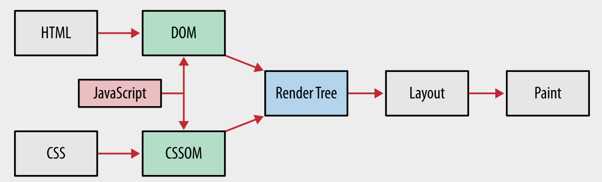
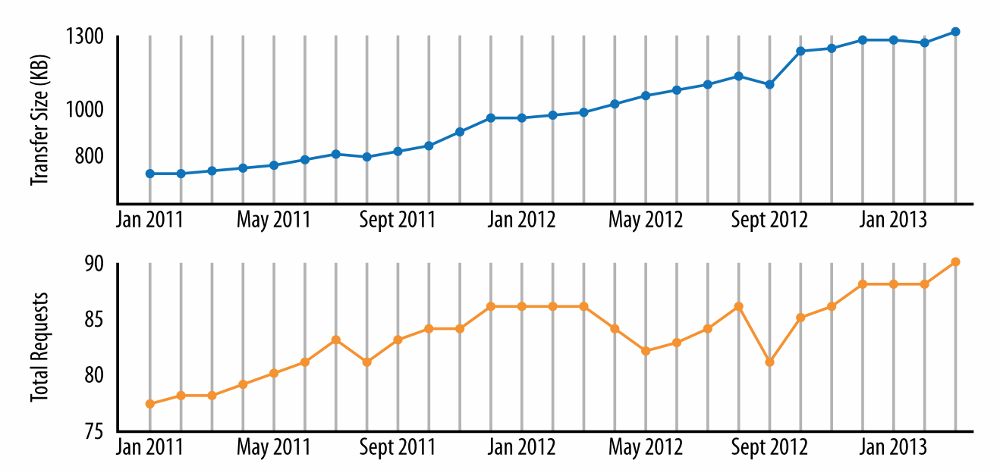

# Web 性能入门
在任何复杂的系统中，性能优化的过程很大一部分是将系统中许多不同且独立的层次之间的相互作用解开，每一层都有自己的约束和限制。到目前为止，我们仔细审视了一些单独的网络组件 - 不同的物理传输方式和传输协议 - 现在我们可以将注意力转向 Web 性能优化：

1. 延迟和带宽对网络性能的影响
2. 传输协议（TCP）强加在 HTTP 上的约束
3. HTTP 协议本身的特点和缺点
4. Web 应用趋势和性能要求
5. 浏览器约束和优化

优化不同层次之间的相互作用和求解相互依赖的一系列方程一样，但是会产生许多可能的解决方案。没有固定的建议或最佳做法，个别组件不断发展：浏览器越来越快，用户连接配置发生变化，Web 应用程序的范围，目标和复杂性都在不断增长。

因此，在我们深入列举和分析特定的最佳实践之前，确定问题真正的原因是相当重要的：什么是现代 Web 应用程序，我们拥有的工具，我们如何衡量网络性能，系统的哪些部分正在帮助或阻碍我们的进步。

# 超文本，网页和 Web 应用
网络在过去几十年中的发展给了我们至少三种不同类型的体验：超文本文档，富媒体网页和交互式 Web 应用。诚然，后两者之间的界线有时对用户来说是模糊的，但从性能的角度来看，对于我们的交流，指标和性能的定义来说每一种都需要不同的方式。

*超文本文档*

超文本文档是万维网的起源，纯文本版本具有一些基本格式并支持超链接。这可能听起来不符合现代标准，但它证明了万维网的前提是成立的，并有着美好的愿景和巨大效用。

*网页*

HTML 工作组和早期浏览器厂商扩展了超文本的定义用于支持其他超媒体资源（如图像和音频），并为更丰富的布局添加了许多其他原语。*网页*时代已经到来，使我们可以用各种媒体类型制作丰富的视觉布局：看起来漂亮但大多是非交互式的，与印刷版比起来没什么不同。

*Web 应用*

JavaScript 的加入与稍后动态 HTML（DHTML）和 AJAX 的革新再次震撼了这一切，并将简单的网页转变成了能够在浏览器内直接响应用户的交互式 Web 应用。这为第一个完整的浏览器应用铺平了道路，如Outlook Web Access（IE5 中支持 XMLHTTP 的开创者），引发了脚本，样式表和标记之间的复杂依赖关系图的新时代。

HTTP 0.9 会话由单个文档请求组成，完全足以传送超文本：单个文档，一个 TCP 连接，然后连接关闭。因此，性能调整仅仅是优化通过短期 TCP 连接的单个 HTTP 请求。

*网页*的出现将传递单个文档转变成传递文档加上它依赖的资源。因此，HTTP/1.0 引入了 HTTP 元数据（头信息）的概念，HTTP/1.1 通过诸如定义良好的缓存，keepalive 等各种面向性能的原语增强了头信息。因此，现在可能有多个 TCP 连接正在使用，并且关键性能指标已从*文档加载时间*转移到*页面加载时间*，通常缩写为 PLT。

**note**
>PLT 最简单的定义是“直到加载转轮在浏览器中停止旋转的时间”。一个更技术的定义是浏览器中的 onload 事件的时间，这是文档及其所有依赖资源（JavaScript，图像等）完成加载后，浏览器触发的事件。

最后，Web 应用使用媒体作为增强标签的主要内容将简单网页转换为复杂依赖图：标记定义基本结构，样式表定义布局，脚本构建交互式应用并响应用户输入并可能会修改样式和标记。

页面加载时间作为网页性能的事实标准逐渐变得不再充分：我们不再构建页面而是构建动态的交互式 Web 应用。不测量或者说不仅仅测量加载每个资源（PLT）的时间，我们现在希望回答具体应用的问题：

1. 应用的加载过程中有哪些关键节点？
2. 用户何时进行首次交互？
3. 用户应该进行如何交互？
4. 每个用户的参与度和转换率是多少？

您的性能和优化策略的成功与您定义并迭代特点应用的测量基准直接相关。没有什么比针对应用知识和测量结果更好，特别是当与业务底线目标和指标相关时。

> **DOM, CSSOM 与 JavaScript**
>现代 Web 应用程序中的“脚本，样式表和标记之间的复杂依赖关系图”是什么意思？为了回答这个问题，我们需要快速浏览一下浏览器的架构，并研究解析，布局和脚本管道如何组织在一起绘制屏幕上的像素。
>
>HTML 文档的解析用于构建文档对象模型（DOM）。同时还有一个被遗忘的表亲，CSS 对象模型（CSSOM），它由特定的样式表规则和资源构成。然后将两者组合形成“渲染树”，此时浏览器拥有足够的信息进行布局并将画面绘制到屏幕上。目前为止还挺好。
>
>然而不幸的是，我们必须介绍我们最喜爱的朋友和敌人：JavaScript。脚本执行可以发出同步的 *doc.write* 并阻塞 DOM 解析和构造。类似地，脚本可以查询任何对象计算之后的样式，这意味着 JavaScript 也可以阻塞 CSS。因此，DOM 和 CSSOM 对象的构造通常是相互交织的：DOM 构造在执行 JavaScript 被之前不能继续，并且在 CSSOM 可用之前 JavaScript 不能继续执行。
>
>应用的性能，特别是第一次加载和“渲染时间”直接取决于如何解决标记，样式表和 JavaScript 之间的依赖关系图。顺便提一句，回顾为什么会有“样式最上，脚本最下”这个流行的最佳实践？现在你知道为什么了！渲染和脚本执行阻塞了样式表;尽可能快地将 CSS 下载给用户。

# 剖析现代网络应用
一个现代的 Web 应用应该是什么样子呢？ [HTTP Archive](http://httparchive.org)可以帮助我们回答这个问题。该项目通过定期抓取最受欢迎的网站（Alexa 前 1M 中的 300,000+），记录每个站点已使用资源，内容类型，头信息和其他元数据并汇总分析得出被跟踪 Web 的构建方式。

截止 2013 年初，网络应用平均由以下内容组成：

发送给 15 个主机的 90 个请求，传输了 1,311 KB 的数据
1. HTML：10 个请求，52KB
2. 图像： 55 个请求，812KB
3. JavaScript：15 个请求，216KB
4. CSS：5 个请求，36KB
5. 其他：5 个请求，195KB

当你读这些数据时，数字已经发生了改变，并且变得更大（图10-2）。上升趋势一直十分稳定，没有停止的迹象。然而，不考虑特定的请求和大小，这些单个组件的数量级仍旧是值得仔细思考的：一般的 Web 应用现在已经超过 1 MB，由大约 100 个来自不同主机的子资源组成！

图 10-2 平均传输大小和请求数量(HTTP Archive)

与桌面版不同，Web 应用不需要单独的安装过程：输入 URL，按 Enter 键，我们便打开并运行了 Web 应用！然而，桌面应用只需花费一次安装成本，而 Web 应用每次访问时都有一个“安装过程” - 下载资源，构建 DOM 和 CSSOM 并执行 JavaScript。难怪网络性能领域增长如此迅速和并成为讨论的热门话题！数以百计的资源，兆字节的数据，数十种不同的主机，所有这些都必须在数百毫秒的时间内汇聚在一起，以实现即时网络体验。

