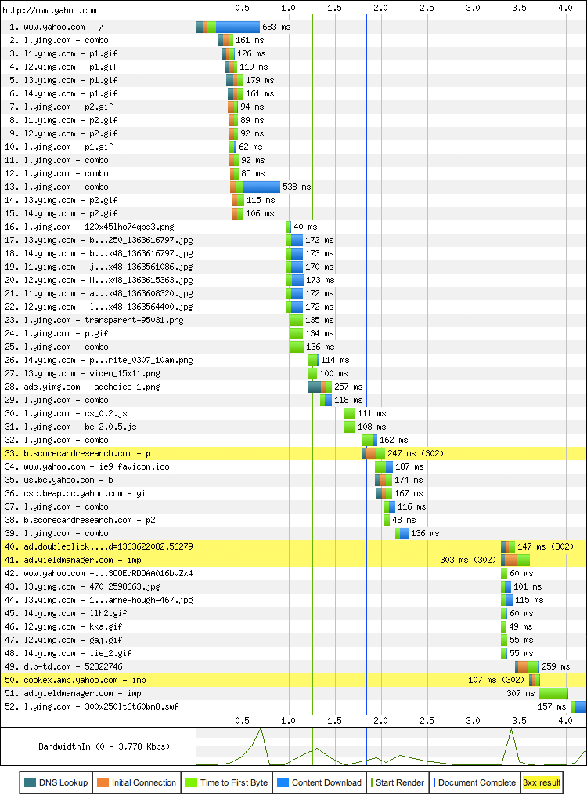
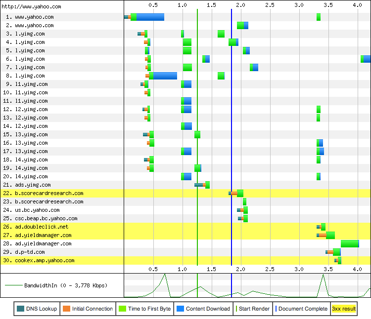

# Web 性能入门
在任何复杂的系统中，性能优化的过程很大一部分是将系统中许多不同且独立的层次之间的相互作用解开，每一层都有自己的约束和限制。到目前为止，我们仔细审视了一些单独的网络组件 - 不同的物理传输方式和传输协议 - 现在我们可以将注意力转向 Web 性能优化：

1. 延迟和带宽对网络性能的影响
2. 传输协议（TCP）强加在 HTTP 上的约束
3. HTTP 协议本身的特点和缺点
4. Web 应用趋势和性能要求
5. 浏览器约束和优化

优化不同层次之间的相互作用和求解相互依赖的一系列方程一样，但是会产生许多可能的解决方案。没有固定的建议或最佳做法，个别组件不断发展：浏览器越来越快，用户连接配置发生变化，Web 应用程序的范围，目标和复杂性都在不断增长。

因此，在我们深入列举和分析特定的最佳实践之前，确定问题真正的原因是相当重要的：什么是现代 Web 应用程序，我们拥有的工具，我们如何衡量网络性能，系统的哪些部分正在帮助或阻碍我们的进步。

# 超文本，网页和 Web 应用
网络在过去几十年中的发展给了我们至少三种不同类型的体验：超文本文档，富媒体网页和交互式 Web 应用。诚然，后两者之间的界线有时对用户来说是模糊的，但从性能的角度来看，对于我们的交流，指标和性能的定义来说每一种都需要不同的方式。

*超文本文档*

超文本文档是万维网的起源，纯文本版本具有一些基本格式并支持超链接。这可能听起来不符合现代标准，但它证明了万维网的前提是成立的，并有着美好的愿景和巨大效用。

*网页*

HTML 工作组和早期浏览器厂商扩展了超文本的定义用于支持其他超媒体资源（如图像和音频），并为更丰富的布局添加了许多其他原语。*网页*时代已经到来，使我们可以用各种媒体类型制作丰富的视觉布局：看起来漂亮但大多是非交互式的，与印刷版比起来没什么不同。

*Web 应用*

JavaScript 的加入与稍后动态 HTML（DHTML）和 AJAX 的革新再次震撼了这一切，并将简单的网页转变成了能够在浏览器内直接响应用户的交互式 Web 应用。这为第一个完整的浏览器应用铺平了道路，如Outlook Web Access（IE5 中支持 XMLHTTP 的开创者），引发了脚本，样式表和标记之间的复杂依赖关系图的新时代。

HTTP 0.9 会话由单个文档请求组成，完全足以传送超文本：单个文档，一个 TCP 连接，然后连接关闭。因此，性能调整仅仅是优化通过短期 TCP 连接的单个 HTTP 请求。

*网页*的出现将传递单个文档转变成传递文档加上它依赖的资源。因此，HTTP/1.0 引入了 HTTP 元数据（头信息）的概念，HTTP/1.1 通过诸如定义良好的缓存，keepalive 等各种面向性能的原语增强了头信息。因此，现在可能有多个 TCP 连接正在使用，并且关键性能指标已从*文档加载时间*转移到*页面加载时间*，通常缩写为 PLT。

**note**
>PLT 最简单的定义是“直到加载转轮在浏览器中停止旋转的时间”。一个更技术的定义是浏览器中的 onload 事件的时间，这是文档及其所有依赖资源（JavaScript，图像等）完成加载后，浏览器触发的事件。

最后，Web 应用使用媒体作为增强标签的主要内容将简单网页转换为复杂依赖图：标记定义基本结构，样式表定义布局，脚本构建交互式应用并响应用户输入并可能会修改样式和标记。

页面加载时间作为网页性能的事实标准逐渐变得不再充分：我们不再构建页面而是构建动态的交互式 Web 应用。不测量或者说不仅仅测量加载每个资源（PLT）的时间，我们现在希望回答具体应用的问题：

1. 应用的加载过程中有哪些关键节点？
2. 用户何时进行首次交互？
3. 用户应该进行如何交互？
4. 每个用户的参与度和转换率是多少？

您的性能和优化策略的成功与您定义并迭代特点应用的测量基准直接相关。没有什么比针对应用知识和测量结果更好，特别是当与业务底线目标和指标相关时。

> **DOM, CSSOM 与 JavaScript**
>
>现代 Web 应用程序中的“脚本，样式表和标记之间的复杂依赖关系图”是什么意思？为了回答这个问题，我们需要快速浏览一下浏览器的架构，并研究解析，布局和脚本管道如何组织在一起绘制屏幕上的像素。
>
>HTML 文档的解析用于构建文档对象模型（DOM）。同时还有一个被遗忘的表亲，CSS 对象模型（CSSOM），它由特定的样式表规则和资源构成。然后将两者组合形成“渲染树”，此时浏览器拥有足够的信息进行布局并将画面绘制到屏幕上。目前为止还挺好。
>
>然而不幸的是，我们必须介绍我们最喜爱的朋友和敌人：JavaScript。脚本执行可以发出同步的 *doc.write* 并阻塞 DOM 解析和构造。类似地，脚本可以查询任何对象计算之后的样式，这意味着 JavaScript 也可以阻塞 CSS。因此，DOM 和 CSSOM 对象的构造通常是相互交织的：DOM 构造在执行 JavaScript 被之前不能继续，并且在 CSSOM 可用之前 JavaScript 不能继续执行。
>
>应用的性能，特别是第一次加载和“渲染时间”直接取决于如何解决标记，样式表和 JavaScript 之间的依赖关系图。顺便提一句，回顾为什么会有“样式最上，脚本最下”这个流行的最佳实践？现在你知道为什么了！渲染和脚本执行阻塞了样式表;尽可能快地将 CSS 下载给用户。

# 剖析现代网络应用
一个现代的 Web 应用应该是什么样子呢？ [HTTP Archive](http://httparchive.org)可以帮助我们回答这个问题。该项目通过定期抓取最受欢迎的网站（Alexa 前 1M 中的 300,000+），记录每个站点已使用资源，内容类型，头信息和其他元数据并汇总分析得出被跟踪 Web 的构建方式。

截止 2013 年初，网络应用平均由以下内容组成：

发送给 15 个主机的 90 个请求，传输了 1,311 KB 的数据
1. HTML：10 个请求，52KB
2. 图像： 55 个请求，812KB
3. JavaScript：15 个请求，216KB
4. CSS：5 个请求，36KB
5. 其他：5 个请求，195KB

当你读这些数据时，数字已经发生了改变，并且变得更大（图10-2）。上升趋势一直十分稳定，没有停止的迹象。然而，不考虑特定的请求和大小，这些单个组件的数量级仍旧是值得仔细思考的：一般的 Web 应用现在已经超过 1 MB，由大约 100 个来自不同主机的子资源组成！

图 10-2 平均传输大小和请求数量(HTTP Archive)

与桌面版不同，Web 应用不需要单独的安装过程：输入 URL，按 Enter 键，我们便打开并运行了 Web 应用！然而，桌面应用只需花费一次安装成本，而 Web 应用每次访问时都有一个“安装过程” - 下载资源，构建 DOM 和 CSSOM 并执行 JavaScript。难怪网络性能领域增长如此迅速和并成为讨论的热门话题！数以百计的资源，兆字节的数据，数十种不同的主机，所有这些都必须在数百毫秒的时间内汇聚在一起，以实现即时网络体验。

## 速度，性能和人类感知
速度和性能是相对的。每个应用根据业务标准，上下文，用户期望以及所需执行任务的复杂性来指定一组针对自身的需求。话虽如此，如果应用必须对用户做出响应，那么我们必须针对特定的 *以用户为中心的感知处理时间常数* 进行规划和设计。尽管生活节奏不断加快，至少我们认为我们的反应时间保持不变（表10-1），无论应用（在线还是离线）或设备（笔记本电脑，台式机或移动设备）类型。

延迟 | 用户感知
--|--
0–100 ms | 即使
100–300 ms | 轻微可感知延迟
300–1000 ms | 机器在工作
1,000+ ms | 大脑切换到别的事情上
10,000+ ms | 放弃任务

表 10-1 时间和用户感知

*note*
>前面的表格有助于解释社区中有关 Web 性能的非正式经验法则：在 250 毫秒以内的渲染页面或者至少提供一些视觉反馈，以保持用户参与度！

为了应用有即时的感觉，必须在几百毫秒内对用户的输入提供可察觉到的响应。经过一秒或以上，用户的工作流与任务的启动之间的链接被破坏，经过十秒之后，用户经常放弃任务除非提供进度反馈。

*note*
Jakob Nielsen 的 *Usability Engineering* 和 Steven Seow 的 *Designing and Engineering Time* 都是每个开发人员和设计师应该阅读的优秀资源！测量时间十分可观，但感觉很主观，经验可以用来设计并改善感知的表现。

>**将网络性能转换为美元和美分**
>
>速度是一个特性，提高响应速度不仅仅为了速度。谷歌，微软和亚马逊广为人知的研究表明，网络性能直接转化为美元和美分 - 例如，Bing 的搜索页面上 2000 毫秒的延迟使得每用户收入减少 4.3％！
>
>同样，Aberdeen 研究超过 160 个组织认为，页面加载时间延迟每增加一秒会导致转换率降低 7％，浏览量减少 11％，客户满意度降低 16％！
>
>更快的网站带来更多的网页访问量，更高的参与度和更高的转化率。然而，不要仅仅是为了表达自己的观点，或者把你理念放在广泛使用的行业基准：衡量网站性能对你自己网站的影响，以及你自己的转换指标。如果您想知道如何应用，请继续阅读，或跳到[针对实际用户的综合性能衡量](https://hpbn.co/primer-on-web-performance/#synthetic-and-real-user-performance-measurement)。

## 分析资源瀑布流
没有提到资源瀑布流的网络性能讨论是不完整的。事实上，资源瀑布流可能是我们所掌握的最有深度的网络性能和诊断工具。每个浏览器都提供了一些查看资源瀑布流的工具，还有诸如 [WebPageTest](http://www.webpagetest.org/) 等很棒的在线工具，可以在各种各样的浏览器上使用。

*note*
>WebPageTest.org 是一个开源项目并且是一个免费的 Web 服务，它提供了一个测试世界各地网页性能的系统：浏览器在虚拟机中运行，可以通过各种连接配置并且可以编写脚本设置浏览器和连接参数。测试结果可通过网页界面获得，这使得 WebPageTest 成为 Web 性能工具包中不可或缺有力工具。

认识到每个 HTTP 请求都是由多个独立的阶段组成（图10-3）这一点是十分重要的：DNS 解析，TCP 连接握手，TLS 协商（如果需要），HTTP 请求的发送，内容下载。这些独立阶段的视觉显示可能会在每个浏览器中略有不同，但为了简单起见，我们将在本章中使用 WebPageTest 版本。确保你熟悉最喜欢的浏览器中每种颜色的含义。

图 10-3 HTTP 请求的组成（WebPageTest）

图 10-3 的详细分析显示，雅虎主页下载用时 683 毫秒，超过 200 毫秒的时间花费在网络等待上，这相当于请求总延迟的 30％！然而，文档请求只是开始，因为我们知道现代 Web 应用还需要各种各样的资源（图10-4）来生成最终的输出。确切地说，要加载雅虎首页，浏览器需要 52 个资源，从 30 个不同的主机获取，累计 486 KB。

资源瀑布流揭示了关于页面结构和浏览器处理流程的一些重要内涵。首先请注意，在获取 www.yahoo.com 的文档内容时，新的 HTTP 请求在同时调度：HTML 解析是逐步执行的，允许浏览器尽早发现所需的资源，并行发送必要的请求。因此，资源获取的调度很大程度上取决于标记的结构。浏览器可能会重新设置一些请求的优先级，但是逐步发现文档中的资源创建了不同资源“瀑布流效应”。

其次请注意，在所有资源完全加载之前，“开始渲染”（绿色垂直线）就已经发生了，允许用户在构建页面时便可以与页面进行交互。事实上，“文件完成”事件（蓝色垂直线）也会在加载剩余的资源之前提前发生。换句话说，浏览器转轮已经停止旋转，用户可以继续他的任务，但是雅虎主页仍在后台逐步填充其他内容，如广告和社交小部件。

图 10-4  Yahoo.com 资源瀑布流 (WebPageTest, 2013 年 3 月)

第一次渲染时间，文档完成以及上一个例子中完成获取最后一个资源的时间之间的差异，很好的说明了我们讨论的不同指标之间的差异。这三个指标中的哪一个是正确的？没有一个确切的答案;每个应用都不同！雅虎工程师们选择优化页面以便利用增量加载使用户尽早获得重要内容，因此他们必须使用针对应用的知识，哪些内容至关重要，哪些内容可以稍后填充。

>*note*
>
>不同的浏览器对于资源的请求时间和顺序有着不同的逻辑。因此，应用程序的性能将因浏览器而异。
>
>提示：WebPageTest 允许您在运行测试时选择浏览器的位置和版本！

网络瀑布流是强有力的工具，可以帮助您揭示所选页面或应用选择的优化或缺少的优化。之前分析和优化资源瀑布流的过程通常被称为*前端性能*分析和优化。不过，这个名字可能是一个不幸的选择，因为它误导了许多人认为所有的性能瓶颈都在现在都客户端上。实际上，尽管 JavaScript，CSS 和渲染流水线是关键并且是资源密集型的步骤，服务器的响应时间和网络延迟（“后端性能”）对于优化资源瀑布流而言同样重要。毕竟，您无法解析或执行在网络上被阻塞的资源！

为了说明这一点，我们只需要从资源瀑布流切换到 WebPageTest 提供的连接视图（图10-5）。

与资源瀑布流不同，每个记录代表一个单独的 HTTP 请求，连接视图显示了每个 TCP 连接的寿命 - 在这种情况下，所有 30 个用于获取 Yahoo! 主页的资源。有什么鹤立鸡群吗？请注意用蓝色表示的下载时间仅为每个连接的总延迟的一小部分：在等待接收每一个响应的第一个字节之前，DNS 查找 15，TCP 握手 30 以及大量的网络延迟（绿色指示）。

图 10-5  Yahoo.com 连接视图 (WebPageTest, 2013 年 3 月)

>*note*
>
>想知道为什么有些请求只显示绿色（到第一个字节的时间）么？许多响应非常小以至于下载时间没有在图上标注。事实上许多请求的响应时间通常主要由往返延迟和服务器处理时间构成。

最后，我们把最好的留到最后。在连接视图的底部可以找到许多真正的惊喜：检查图 10-5 中的带宽利用率图表。除了几次短的爆发之外，可用连接的利用率非常低 - 看起来我们不受连接带宽的限制！这是一个异常，还是更糟的浏览器错误？不幸的是，都不是。事实证明，带宽不是大多数 Web 应用性能的限制因素。相反，瓶颈是客户端和服务器之间网络的往返延迟。

# 性能支柱：计算，呈现，网络
执行 Web 程序主要涉及三个任务：获取资源，页面布局和渲染以及 运行 JavaScript。渲染和脚本的执行过程服从单线程交错模型;不可能对获取的文档对象模型（DOM）进行并发修改。因此，如我们在[DOM, CSSOM 与 JavaScript](https://hpbn.co/primer-on-web-performance/#dom-cssom-and-javascript)中所看到的那样，优化渲染和脚本执行在运行时协同工作是至关重要的。

然而，如果浏览器被网络阻塞，等待资源到达，那么优化 JavaScript 执行和渲染流水线也不会有太好的效果。快速高效地传递网络资源是浏览器中运行的每个应用的性能基础。

但是可能有人会问，互联网速度日益加快，这个问题会不会自然而然的解决呢？是的，我们的应用越来越大，但是每个 ISP 和移动运营商无处不在的广告都在证明全球平均速度已经达到 3.1 Mbp[接入网带宽带宽](https://hpbn.co/primer-on-latency-and-bandwidth/#bandwidth-at-the-network-edge)并且还在增长，那么有什么好担忧的呢？不幸的是，你可能会有这样的感觉并且雅虎的例子也有所显示，如果实际是这样的话你也不会读这本书了。让我们仔细看看吧。

>*note*
>
>有关带宽和延迟的趋势和相互作用的详细讨论，请参阅之前的[延迟与带宽基础](https://hpbn.co/primer-on-latency-and-bandwidth/)。

## 带宽更高并不太重要
稍安毋躁;当然带宽很重要！毕竟，当地的 ISP 和移动运营商的每一个商业广告都不断提醒我们，它有很多好处：更快的下载，上传和数据流，都加速到[插入最新的数字] Mbps的速度！

更高的带宽对于数据速率始终是有益的，特别是涉及批量数据传输的情况：视频和音频流或任何其他类型的大量数据传输。然而，当涉及日常网页浏览时，这需要从数十个不同的主机获取数百个相对较小的资源，往返延迟是限制因素：

1. 雅虎主页的高清视频流带宽有限。
2. 加载和呈现雅虎主页受限于延迟。

根据流式传输视频的质量和编码，可能需要的带宽范围内从几百 Kbps 到几 Mbps 的范围不等，例如高清 1080p 视频流需要 3Mbps 以上。Netflix 等流媒体视频服务越来越受欢迎证明了许多用户已经可以满足这个速率要求了。那么为什么下载一个要小得多的网络应用对于对于能够流式传输高清电影的连接来说是一个挑战？
