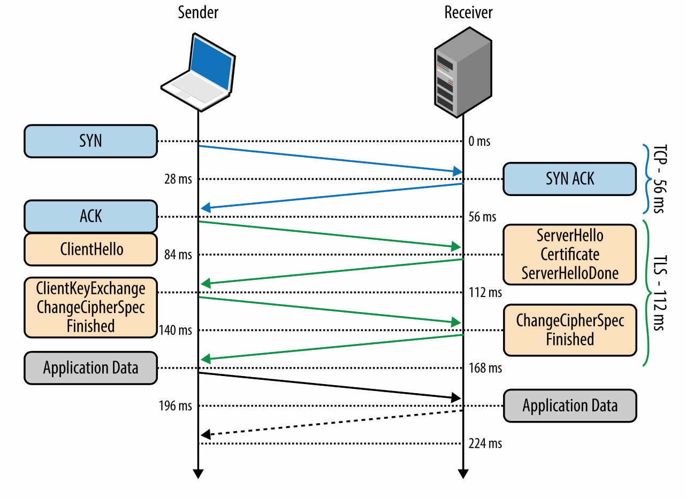

# 安全传输层协议

SSL 协议是最初是由网景公司开发用来确保网络中电子商务数据交易的安全，这需要对用户数据进行加密，身份验证以及保证数据完整性等等。为了实现这一点，SSL 协议在应用层实现，构建在 TCP 之上， 如图 4-1 所示，使得在它上面的协议（HTTP，电子邮件，即时通讯，和许多其他应用）在网络操通信时操作不变，同时保证跨网络交流时的安全。

图 4-1 安全传输层协议 (TLS)

如果正确使用 SSL 协议，第三方观察者只能推断出连接的双方，加密类型，数据发送的频率和大致的数据量，无法读取或者修改任何的实际数据。

**note**
> 当 IETE 将 SSL 协议标准化的时候，被重命名为安全传输层协议(TLS)。TLS 和 SSL 可以交换使用，但是技术上说，它们是不一样的，描述了协议的不同版本。

 SSL 2.0 是该协议第一个公开发布的版本，然而因为发现了大量安全漏洞，它很快被 SSL 3.0 替代。由于 SSL 协议是网景的专利，IETF 标准化协议时，1999 年一月发布的 RFC 2246 中更名为 TLS 1.0。从那时起，IETF 不断迭代该协议，解决了很多安全漏洞，同时也扩展了它的功能。TLS 1.1(RFC 2246) 在 2006 年 4 月发布，TLS 1.2(RFC 5246) 在 2008 年 8 月发布，现在是 TLS 1.3。

这就是说，不要让大量的版本误导了你，你的服务器应该始终使用最新版本的 TLS 协议来确保安全性，功能以及性能。实际上，一些对性能有重要影响的特性，诸如 HTTP/2，明确要求使用 TLS 1.2 或以上版本，否则将断开连接。

**note**
> TLS 设计使用在像 TCP 这样的可靠传输协议之上。然而它现在也可以运行在数据报协议上，如 UDP。RFC 6347 定义了安全数据包传输协议(DTLS)，它基于 TLS 协议，能够提供TLS类似的安全保证同时保留数据报的传输模式。

# 加密，身份验证和数据完整性
TLS 协议设计用来为应用提供三个基本服务加密，身份验证和数据完整性。技术上来讲，并不总是需要这三个服务。你可能在没有验证身份的情况下接受一个证书，但是你应该意识到这样做带来的安全风险。实际上，一个安全的网络应用需要所有的这三个服务。

*加密* 用来混淆从一个主机发送到另一个主机的数据

*身份验证* 判断是否提供了有效的验证材料

*完整性* 检测数据是否有篡改或者伪造

为了建立一个加密的安全数据通道，连接的双方必须在后续使用的加密算法以及加密数据的密钥上达成一致。TLS 协议制定了定义明确的握手序列来完成进行这些数据交换，我们将在之后的 [TLS 握手](https://hpbn.co/transport-layer-security-tls/#tls-handshake) 中讨论它的细节。TLS 在实际中运转良好的一个原因是它使用了公钥加密算法（又被称作对称密钥算法）的巧妙的握手过程，它使得连接双方可以在彼此没有了解的情况下通过一个非加密的信道完成私钥分享。

作为 TLS 握手的一部分，这个协议允许双方检验身份。在浏览器中使用的时候，校验机制允许客户端验证服务器是不是它宣称的身份（例如你的银行）而伪装的名称或者 IP 地址。这个验证过程基于建立好的信任链，查看[信任链与授权证书](https://hpbn.co/transport-layer-security-tls/#chain-of-trust-and-certificate-authorities)。另外，服务器也可以选择验证客户端的身份，例如公司代理服务器可以校验所有的雇员，每一个雇员都应该有公司签发的唯一证书。

最终，在有了加密和身份认证后，TLS 协议还提供了消息分片机制，为每一个信息加上了信息认证码（MAC）。MAC 算法是一种单向加密哈希函数，它的密钥由连接的两端协商完成。无论一个何时一个 TLS 记录发送的时候都会生成一个 MAC 值并附加在信息中，接收方可以通过计算并验证 MAC 的值来确保信息的完整性和真实性。

这三个机制组合起来成为了网络中安全交流的基础。所有的现代网络浏览器均提供了一系列的加密套件，可以用来验证连接双方，透明地对每一条记录进行完整性检查。

>**代理，中间人，TLS 与网络中的新协议**
>HTTP 广泛的成功创造了一个活跃的生态环境，包括网络中的各种代理与中间人，如缓存服务器，安全防火墙，网络加速器，内容过滤等等。在一些情况下，我们能感受到它们的存在（显式的带来），还有一些服务对于终端用户是完全透明的。
>
>不幸的是，它们的存在也为一些试图通过 HTTP/1.x 协议传输数据的应用带来了一些麻烦。一些代理服务器在仅仅转发 HTTP 它们不能解析的扩展，一些代理服务器盲目地处理了不应该处理的数据。另外，一些安全服务器会恶意地推断正常数据。
>
>换句话说，在实践中，偏离在 80 端口定义良好语义的 HTTP/1.x 经常造成不可靠部署：一些客户端没有问题，另一些却遇到了没有定义且难以重现的行为，诸如相同的客户在变换了网络环境中看到了不一样的行为。
>
>因为这些行为，新的协议和 HTTP 扩展，例如 WebSocket，HTTP/2 等需要通过 HTTPS 信道来避免中间代理来提供一个可靠的部署模式：加密的信道混淆了所有中介媒介的数据。这就是为什么大多数的 WebSocket 指南都会告诉你要使用 HTTPS 来传输数据给移动客户端。

# 任何地方都要使用 HTTPS
通过 HTTP 或者 其他协议建立的非加密通信造成了大量的隐私，安全和完整性易受侵犯的问题。数据交换容易收到窃听，修改和模仿，这会暴露用户的整数，历史，身份和其他敏感信息。我们的应用需要要保护自己和用户，通过 HTTPS 传输数据来避免这些威胁。

*HTTPS 保护网站的完整性* 加密阻止了侵入者修改数据，例如修改内容，加入不想要的或者恶意内容等等。

*HTTPS 保护用户的隐私和安全* 加密阻止了侵入者监听数据。每一个不受保护的会暴露一些关于用户的敏感信息，并且当这样的数据包含了多个会话的信息时，可以被用来发现匿名用户的身份还可以暴露其他敏感信息。只要用户会担心的浏览活动，都应该考虑隐私和敏感信息。

*HTTPS 提供了网络中强大的特性* 诸如获取用户地理位置，照相，录像等等一系列新的网络平台特性提高了离线应用的体验，这需要用户显式的开启它们，也需要 HTTPS。HTTPS 提供的安全和完整性是传递用户许可的关键组成部分。

国际互联网工程任务组(IETF)和国际互联网架构委员会(IAB)为开发者和协议制定中提供了指南来鼓励使用 HTTPS：

1. IETF: [大量的监视是一种攻击](https://tools.ietf.org/html/rfc7258)
2. IAB: [互联网保密声明](https://www.iab.org/2014/11/14/iab-statement-on-internet-confidentiality/)

随着我们对互联网依赖的增加，每一个人面临的风险越来越大。应用的开发者和用户都有责任通过使用 HTTPS 来保护我们自己。

**note**
> 美国政府管理预算局发布的 [只使用 HTTPS 标准](https://https.cio.gov/) 是一个不错的 HTTPS 额外信息和一个部署 HTTPS 的实际的例子。

> **Let’s Encrypt **
> 
> 对于部署 HTTPS 一个常见的阻碍是需要从受信任的权威机构购买证书，[信任链与授权证书](https://hpbn.co/transport-layer-security-tls/#chain-of-trust-and-certificate-authorities)。 2015 年发起的[Let’s Encrypt ](https://letsencrypt.org/)项目旨在解决这一特定问题
>
> “ Let’s Encrypt 是由互联网安全研究小组提供的免费，自动的开放证书管理机构。Let’s Encrypt 和 ACME 协议是的搭建 HTTPS 服务器和自动获取浏览器信任的证书成为了可能呢。
>
>访问项目主页，了解一下如何在你自己的站点中使用它。没有限制，每一个人都可以为它们的站点获取一个免费的授信证书。

# TLS 握手
在客户端和服务器通过 TLS 交换数据之前需要协商加密通道：客户端课服务器必须在 TLS 协议版本，加密套件和上达成一致，如果需要的话还需进行证书验证。不幸的是，这些过程都需要在客户端与服务器之间传递额外的数据包，如图 4-2 所示，这增加了 TLS 连接的延迟。

图 4-2 TLS 握手协议

*note*
> 图 4-2 和之前建立 TCP 连接的例子中有相同的假设，即纽约和伦敦之间有 28 ms 的单向延迟，详细信息查看 表 1-1。

*0 ms* TLS 运行在可靠传输(TCP)之上，意味着我们必须要先完成 TCP 三次握手，这占用了一个来回。

*56 ms* TCP连接建立后，客户端以纯文本的方式发送一些规范，如 TLS 协议版本，支持的加密套件的列表，和其他试图使用的 TLS 选项。

*84 ms* 服务器为以后的通讯选择了 TLS 协议版本，从客户端提供的加密套件列表中选择一个，附加上它的证书，将相应送给客户端。另外，服务器还可以发送一个请求客户端的证书和其它 TLS 扩展参数。

*112 ms* 假设双发在版本和加密算法上达成了一致，并且客户端承认服务器提供的证书，客户端开始交换 RSA 或者迪菲-赫尔曼密钥用于建立加密会话的对称密钥。

*140 ms* 服务器处理客户端发过来的密钥，通过 MAC 校验信息完整性，返回个客户端加密过的 **Finished**

*168 ms* 客户端用完成协商的对称密钥解码信息，验证 MAC，如果一切正常，那么信道建立完成，应用数据可以开始传递。

在上述解释中，一个新的 TLS 连接的建立中一个完整的握手需要两个来回，这是一个坏消息。然而实际情况中，我们可以做到更好，只需要一个来回。

1. False Start 是 TLS 协议的扩展，它允许客户端和服务器在只完成一部分握手的情况下创术加密过的数据。例如，一旦 **ChangeCipherSpec** 和 **Finished** 信息送达，但是不需要另一方做同样的事情。这个优化将新的 TLS 连接开销降低到 1 个来回，查看 [开启 TLS False Start](https://hpbn.co/transport-layer-security-tls/#enable-tls-false-start)
2. 如果你已客户端之前和服务器有过通信，可以使用“简化握手”，这需要一个往返，并且通过重用之前为安全会话达成一致的参数降低了客户端和服务器的 CPU 消耗，查看[TLS 会话恢复](https://hpbn.co/transport-layer-security-tls/#tls-session-resumption)

**note**
> [TLS 1.3](https://tools.ietf.org/html/draft-ietf-tls-tls13-20) 的设计目标之一就是降低建立安全连接的额外延迟： 新连接需要 1-RTT，恢复会话 0-RTT

# RSA，迪菲-赫尔曼和前向加密
由于历史和商业原因，RSA 握手在 TSL 部署的密钥交换机制中占据了主要地位：客户端生成了一个对称密钥，用它加密服务器的公钥并把它发送给服务器作为建立会话的对称密钥。反过来，服务器使用它的私钥解密发送过来的公钥，完成密钥交换。从这一点开始，服务器和客户端在对称密钥上达成一致，并且用来加密会话。

RSA 握手运转良好，但是它有一个重要的缺点：用于认证服务器和解密发送给服务器的对称密钥所有的公-私密钥是一样的。这导致了如果有一个攻击者获取了服务器的私钥，并且坚挺了数据交换，他们可以解密整个会话。更糟糕的是，攻击者可以暂时记录下整个加密会话，一旦他获取到私钥便可以解密这些数据。

相反，迪菲-赫尔曼密钥交换允许客户端和服务器不在握手中显式的交流私钥来完成协商：服务器的私钥只用了加密和验证握手，但是建立好的对称私钥永远不会离开客户端或者服务器端，这就永远不会被一个被动的攻击者拦截到私钥。

**note**
> 维基百科的文章[迪菲-赫尔曼密钥交换](https://en.wikipedia.org/wiki/Diffie–Hellman_key_exchange)可以用来学习算法和它的性质。

迪菲-赫尔曼密钥交换可以用来降低过去交流的风险，我们在每一次密钥的时候可以生产一个新的短暂的密钥并且丢弃之前的密钥。因为我们不会交换临时密钥，并且只会在新的会话中使用，即使在最坏的情况下，攻击者侵入客户端或者服务器端并且取得会话密钥也只能破解当前或者之后的会话，对于攻击者解密之前的会话没有任何帮助。

